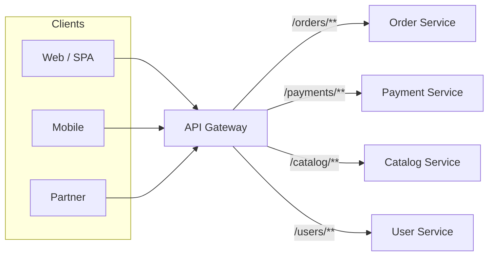
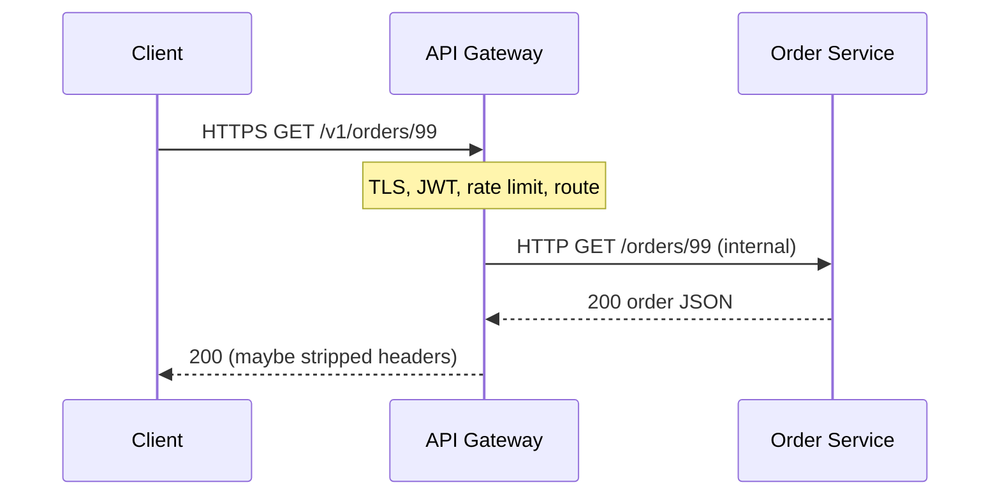
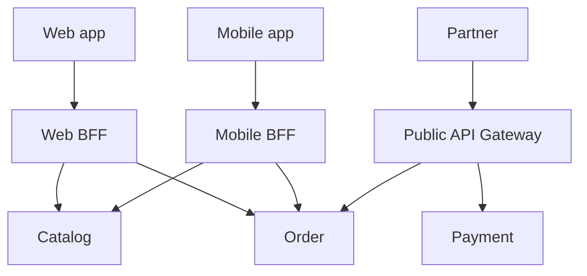

# API Gateway Pattern in Microservices — Detailed Study

Starting reference: [API Gateway walkthrough](https://youtu.be/JNmiOw26PGg?si=8ixXB8tiMiYEuxO7)

This note is a mid-to-senior study of the **API Gateway** pattern: a single (or few) **north-south** entry point(s) in front of many microservices; what it should own (routing, auth, TLS, rate limits, light transform); what it must not own (domain logic, data, fat aggregation); how it differs from a BFF, an aggregator, a reverse proxy, and a service mesh; and when a dumb NGINX is enough.

Related local notes: `Aggregator_Pattern.md` (composition vs edge routing), `Service_Discovery_Pattern.md` (how the gateway finds backends), `Circuit_Breaker_Pattern.md` (breakers at the edge vs in the app), `Strangler_pattern.md` (gateway as the cutover point off a monolith), `DISTRIBUTED_system.md` (extra hop, client- vs server-side LB).

---

## 1. What it is

After you split a monolith, you have **N services**, N ports, N versions, N auth schemes. Mobile, web, and partners should not dial `order-svc:8080`, `payment-svc:9090`, and last week’s ClusterIP.

**API Gateway:** a reverse proxy that is the **only public front door**. Clients talk to one hostname (`api.company.com`). The gateway:

1. **Routes** the request to the right internal service (path, host, header, method).
2. Applies **cross-cutting** policy: TLS, authn/authz, rate limits, request size, CORS.
3. Optionally **transforms** (strip headers, rewrite path, protocol translation HTTP ↔ gRPC).
4. Returns the downstream response. The client never sees the internal graph.

```
Client  →  API Gateway  →  Order Service
                        →  Payment Service
                        →  Catalog Service
```

Chris Richardson: the gateway is a **server-side facade**. Microsoft: **Gateway Routing** (and optionally **Gateway Aggregation**). Netflix popularized a dedicated edge (Zuul) so devices did not hardcode 100+ internal APIs.

**Interview-safe sentence:** *An API gateway is a single entry point that routes and polices north-south traffic so clients do not know internal topology, ports, or versions. Cross-cutting concerns live at the edge; domain logic stays in services.*

---

## 2. Why it exists

Without a gateway, every client becomes an ops engineer for your estate.

| If clients call services directly | What actually happens |
| --- | --- |
| **Topology leak** | Apps hardcode `payment.internal:9090`, gRPC ports, canary hosts. A rename or split is a **client release**. |
| **N TLS / N auth** | Each service terminates HTTPS and validates JWTs. Miss one → a public pod. Duplicate CORS, mTLS bootstrap, API keys. |
| **No one place to say “slow down”** | Rate limits, WAF, IP allowlists, bot checks must be copied 40 times or not done. |
| **Version chaos** | `/v1` vs `/v2` becomes a convention every team invents differently. Clients pin to internal URLs. |
| **Mobile / partner WAN** | Chatty fan-out (see `Aggregator_Pattern.md`). Even without aggregation, you still do not want the phone on the mesh. |
| **Change of internals** | Strangling a monolith, merging two services, or moving to gRPC behind JSON should **not** change the public contract. |

The gateway **hides churn**. Internals can split, rename, and re-protocol. The public API is a **product**. The mesh and ClusterIPs are not.

This is the same reason you do not publish Kubernetes Services to the internet and hope NetworkPolicy is enough. **North-south** needs an identity, a quota, and a stable URL.

---

## 3. Typical responsibilities (the edge checklist)

A production gateway is a **policy + routing** layer. Know this list; interviews treat it as the definition.

| Responsibility | What it means | Smell if you go further |
| --- | --- | --- |
| **Routing** | Path/host/header → backend cluster. Canary, blue-green, path prefix `/orders/**`. | Encoding business workflows (“if cart > $X call fraud then inventory”) |
| **Authn / Authz** | Terminate OIDC, validate JWT, API keys, mTLS from partners. Optionally inject `X-User-Id` after verify. | Re-implementing fine-grained domain ACL that belongs in the service (who may refund *this* order) |
| **TLS termination** | HTTPS at the edge; HTTP or mTLS inside the cluster. Certs, SNI, HTTP/2. | Terminating TLS on every pod *and* also at the gateway with no plan (double complexity) |
| **Rate limiting / quota** | Per IP, per API key, per tenant, per route. Protects backends from stampede and abuse. | Fair-share billing logic that needs the order ledger |
| **Request / response transform** | Path rewrite, header allowlist, protocol transcode (REST → gRPC), strip internal headers. | Mapping five JSON schemas into a “canonical enterprise model” |
| **Light aggregation** | 2–3 independent GETs stitched for a simple screen (Microsoft Gateway Aggregation). | Sequential 6-step checkout on the gateway thread |
| **Caching** | Cache **idempotent GETs** at the edge (CDN, gateway cache) with explicit TTLs. | Caching POSTs, personalized carts without vary-by-auth |
| **Logging / tracing / metrics** | Access logs, trace context (`traceparent`), edge latency vs origin latency, 4xx/5xx by route. | Parsing payloads to “understand the business” |
| **API versioning** | `/v1` vs `/v2` routes, deprecation headers, sunset. | Forever-dual-running every version in gateway Lua |
| **Request validation (shallow)** | Size limits, required headers, OpenAPI at the edge for **shape**. | Full domain validation (SKU exists, price matches) |
| **Circuit breaking / retries** | Coarse: if Catalog cluster is gone, fail fast 503. Retries only on idempotent GETs. | Domain fallbacks (“approve the payment anyway”) — that is the **service** (`Circuit_Breaker_Pattern.md`) |
| **WAF / threat** | OWASP, bot, geo. Often a layer in front of or inside the gateway. | Building a custom WAF in application filters |

**Rule:** if the rule is the same for **every** service (auth scheme, TLS, “100 rps per key”), it belongs at the gateway. If the rule needs **Order’s database**, it belongs in Order Service.

---

## 4. What the gateway must NOT do

A fat gateway is a **distributed monolith with a nicer hostname**. This is the section that separates 3-year from 6-year answers.

**Do not:**

- **Own domain data.** No “gateway database” of orders, prices, or users (beyond a token cache / session store if you insist — prefer stateless JWT).
- **Run heavy business logic.** Pricing rules, inventory reservation, saga compensation, “apply coupon then tax then loyalty” — those are services (or a saga). Gateway filters that call four backends **in order** with branching are an orchestrator you cannot test.
- **Become the composition engine for the company.** Thin stitch is OK. Product-page merge of Catalog + Price + Stock + Reviews + Ads belongs in a **BFF or query service** (`Aggregator_Pattern.md`).
- **Be the source of truth for authorization beyond the edge.** Gateway can say “valid token, role `user`.” Order Service still checks “this user owns order 99.”
- **Fan-out writes.** `POST /checkout` that charges, reserves stock, and emails from NGINX is a saga on the HTTP thread. Return `202` to a command API instead.
- **Hide a shared database.** Routing to three services that all JDBC the same `app` schema does not make you microservices (`Database_per_service.md`).

**God-gateway symptoms:** every team’s deploy waits on a gateway config PR; Lua/Java filters contain `if productType ==`; p99 is dominated by sequential downstream calls inside the gateway; you cannot run a service locally without the gateway’s “business” plugins.

Interview-safe sentence: *The gateway is infrastructure with a public URL, not a place to put the domain model.*

---

## 5. Architecture (happy path)





**Flow:**

1. Client hits a **stable** public URL. DNS → gateway (or cloud LB → gateway pods).
2. Gateway terminates TLS, authenticates, checks quota, matches a **route**.
3. It resolves the backend via **service discovery** (`Service_Discovery_Pattern.md`: k8s Service, Consul, or the gateway’s own upstream list).
4. It proxies (HTTP, optionally transcodes to gRPC). It may add correlation IDs.
5. Response goes back. Internal hostnames never leak (`Server` headers stripped).

The gateway is **stateless** in the happy design: scale horizontally behind an NLB/ALB. Sticky sessions at the gateway are a smell (put session in the token or a dedicated session store).

---

## 6. Related patterns (keep them distinct)

Interviews mash gateway, BFF, aggregator, and mesh into one word. Separate **direction of traffic** from **who composes**.

| Pattern | Question it answers | Relation to API gateway |
| --- | --- | --- |
| **API Gateway** | How do **external** clients enter? | **This pattern.** North-south facade + policy. |
| **BFF (Backend for Frontend)** | How does *this* client type get a tailored API? | A **gateway-shaped service per channel** (web BFF, mobile BFF). Same edge idea, **narrower** contract. Not one mega-gateway for all UIs. |
| **Aggregator / API composition** | How do I **merge** N reads into one payload? | Gateway *may* do a **thin** aggregate. Fat merge is a BFF or query service. Composition ≠ routing. |
| **Reverse proxy / Ingress** | How do I terminate TLS and path-route? | A **subset**. NGINX Ingress *is* a simple gateway. “API Gateway” usually adds auth plugins, quotas, developer portal. |
| **Service mesh** | How do **services** talk to each other (east-west)? | Mesh: mTLS, retries, outlier ejection **inside** the cluster. Gateway: public entry. They **stack**; they are not substitutes. |
| **Strangler** | How do I replace a monolith incrementally? | Gateway routes `/legacy/**` to the monolith and `/catalog/**` to the new service. The facade **is** the strangler seam (`Strangler_pattern.md`). |
| **Service discovery** | Who is alive behind this route? | Gateway **consumes** discovery; it is not the registry. |

### 6.1 BFF vs one mega-gateway

Sam Newman’s BFF: **one backend per frontend**. Mobile wants small payloads and different auth (device attestation). Web wants a richer graph. Partners want a frozen, versioned REST.



| | **One mega-gateway** | **BFF per client type** |
| --- | --- | --- |
| Teams | All public API changes collide in one repo/config | Web team owns Web BFF; mobile owns Mobile BFF |
| Payload | Lowest common denominator or a kitchen-sink DTO | Shaped for **that** UI |
| Deploy coupling | High — one pipeline for every consumer | Lower — mobile release ≠ web gateway release |
| Cost | One ops surface | More services to run |
| Fits | Partner/public API, simple routing estate | Product UIs with divergent needs |

**2026 default:** a **thin shared gateway** (TLS, WAF, global rate limit, IP allowlist) in front of **BFFs or domain services**. Do not make one Kong cluster the merge layer for every screen *and* the partner API *and* the saga starter.

### 6.2 Gateway vs aggregator

| | **API Gateway** | **Aggregator** |
| --- | --- | --- |
| Primary job | **Edge**: route + policy | **Compose**: N calls → 1 DTO |
| Lives | Ingress / Kong / AWS API GW | BFF, query service, or *thin* gateway stitch |
| Failure | 502/503 if the **target route’s** cluster is down | Partial body if **optional** downstreams fail |
| Logic | Declarative routes, plugins | Merge code, required vs optional fields |
| If you mix them badly | Gateway Lua that implements PDP | Aggregator that also does OAuth for the whole company |

*Gateway routes; aggregator composes. A gateway that aggregates is wearing two hats — keep the second hat small.* Full treatment: `Aggregator_Pattern.md`.

### 6.3 Gateway (north-south) vs service mesh (east-west)

```
Internet  →  API Gateway  →  Order  →  (mesh sidecar)  →  Payment
   north-south                    east-west
```

| | **API Gateway** | **Service mesh** (Istio / Linkerd / Envoy sidecar) |
| --- | --- | --- |
| Traffic | **North-south**: client → cluster | **East-west**: service → service |
| Who authenticates | End users, API keys, partner mTLS | Workload identity (SPIFFE), pod-to-pod mTLS |
| Typical policy | WAF, user JWT, per-consumer quota, public versioning | Retries, timeouts, outlier ejection, circuit at *instance* level |
| Clients | Browsers, mobile, third parties | Other microservices |
| Replaces the other? | **No.** Mesh does not give you a public URL or a developer portal. | **No.** Gateway does not mTLS every in-cluster hop by default (unless you force it). |

You can run **Envoy as both**: an ingress gateway **and** sidecars. Same dataplane, different **role**. Saying “we have Istio so we don’t need an API gateway” usually means you still have an **Istio Ingress / Gateway API** — that *is* the north-south gateway.

---

## 7. Implementation (conceptual, not a product tutorial)

All of these are **gateways**. Pick by ops skill, cloud, and whether you need a developer portal vs “just Ingress.”

| Product | Shape | Typical fit |
| --- | --- | --- |
| **NGINX / NGINX Ingress / HAProxy** | Reverse proxy. Routes, TLS, basic auth/rate limit. | **Simple** estates; Kubernetes Ingress; “we need a door, not a platform” |
| **Kong** | NGINX/OpenResty + plugin ecosystem (OIDC, rate limit, transform). DB or DB-less. | Teams that want plugins and a portal without writing Java |
| **Spring Cloud Gateway** | JVM, reactive, Spring Security, discovery-aware. | Java shops; programmatic routes; already on Spring Cloud |
| **Envoy** (standalone or mesh ingress) | L7 proxy, xDS, HTTP/gRPC, excellent observability. | Mesh-centric platforms; high-performance edge |
| **AWS API Gateway** (+ ALB/NLB, Lambda, HTTP APIs) | Managed, per-route auth, usage plans, mapping templates. | Serverless / AWS-native; pay per request; beware payload/timeout limits |
| **Apigee** (and similar: Azure APIM, Google ESPv2) | Full **API management**: products, keys, analytics, monetization. | Enterprise partner APIs, billing, multi-team catalogs |
| **Zuul 1 / 2** | Netflix edge (historical). Zuul 1 is blocking servlet; Zuul 2 is netty. | Legacy Netflix OSS. New JVM work: **Spring Cloud Gateway** or Envoy, not Zuul 1 |

**What to actually configure (same ideas everywhere):**

- **Upstreams / clusters** from discovery or a static list.
- **Routes** with predicates (path, method, header).
- **Plugins / filters** ordered: auth before proxy, rate limit before expensive routes.
- **Timeouts** shorter than the client’s patience; **retries** only for idempotent methods.
- **No business code** in the plugin if a service can own it.

**Kubernetes 2026:** **Gateway API** (and/or Ingress) in front of Services. The “API Gateway product” may sit behind a cloud LB as Deployment pods, or be the managed cloud API GW with VPC Link to NLB.

Do not invent a custom Java servlet “gateway” that reimplements TLS and JWT unless you are a platform company. The failure mode is you become Kong with worse CVEs.

---

## 8. Failure modes and trade-offs

The gateway concentrates **power and blast radius**. That is the point — and the risk.

| Failure mode | What it looks like | What to do |
| --- | --- | --- |
| **SPOF** | Gateway down → **entire** public API dark. One bad config reload drops all routes. | HA (3+ pods, PDB, multi-AZ). Canary gateway config. Health checks that do not depend on *every* backend. Separate **internal** admin gateway from public. |
| **Bottleneck** | All RPS through one under-sized hop. TLS + JWT verify + Lua on every request. CPU-bound p99. | Horizontal scale; keep plugins cheap; terminate TLS at a dedicated layer if needed; cache JWKS; do not regex-parse bodies on the hot path. |
| **Extra hop latency** | +2–10ms in DC (fine). + a cold JVM gateway + sequential filters (not fine). | Measure edge vs origin. Do not add hops for fashion. HTTP/2, connection pooling to backends. |
| **Over-aggregation** | Gateway waits on 8 backends; mobile SLO dies; optional reviews take down checkout. | Move composition to BFF; classify required vs optional (`Aggregator_Pattern.md`). |
| **Deploy coupling** | Every team needs a gateway PR to ship a path. Gateway team is the bottleneck / merge hell. | Self-service routes (Ingress/Gateway API per team, GitOps). **Coarse** shared policy; **fine** routes owned by the service team. |
| **Config as code nobody tests** | Regex route steals `/orders` from billing. Silent 404. | Contract tests, staging, shadow traffic, route unit tests (Spring Cloud Gateway has these). |
| **Retry amplification** | Gateway retries POSTs → double charge. | Retry GET/idempotent only; idempotency keys on writes. |
| **Timeout stacking** | Gateway 60s, service 60s, DB 60s — user already gone, threads still held. | Budget timeouts; fail fast (`Circuit_Breaker_Pattern.md`). |
| **Auth at the edge only** | Compromised pod inside the cluster calls Payment with no user context. | Zero-trust: mesh mTLS + service still enforces ACL. Gateway auth is **necessary, not sufficient**. |
| **Header injection** | Client sends `X-User-Id: admin`. Gateway forgets to overwrite after JWT. | **Strip** untrusted identity headers; set them only after verify. |
| **God plugin** | 3k lines of Groovy/Lua. | Extract a service. Gateway stays declarative. |

**Latency honesty:** one extra hop is usually **cheaper** than four WAN hops from the phone. The hop becomes a problem when the gateway **does work** (aggregation, blocking I/O, giant transforms), not because NGINX forwarded a packet.

---

## 9. Comparison: direct vs gateway vs BFF vs mesh

| | **Client → service (no facade)** | **API Gateway** | **BFF** | **Service mesh** |
| --- | --- | --- | --- | --- |
| Who the client dials | Each service URL | One (or few) public hosts | One host **per client type** | Not for browsers; sidecars for pods |
| Hides internal topology | No | **Yes** | Yes (for that channel) | Hides pod IPs **east-west**, not a public API |
| Cross-cutting (TLS, user auth, WAF) | Duplicated or missing | **Central** | Central **per BFF** (plus maybe a shared edge) | Workload mTLS, not user OAuth |
| Aggregation | Client fans out | Optional, **keep thin** | **Primary** place to compose/shape | No |
| Extra hop for the user | 0 (but N WAN calls) | 1 | 1 | 0 for the user (user never hits the sidecar) |
| Team autonomy | High (until a client breaks) | Low if one shared config; medium with self-service routes | High per channel | Platform team owns mesh; apps stay dumb |
| Failure domain | Per service (client must handle N) | **Whole public API** | One channel | Data plane / control plane inside cluster |
| Best fit | Tiny internal tools on a LAN, 2 services, VPN | Public/partner API, many services, shared policy | Divergent web vs mobile vs TV | In-cluster resilience and identity |
| Typical tools | Direct k8s Ingress per service (still an edge!) | Kong, AWS API GW, Spring Cloud Gateway, Envoy ingress | Node/Java BFF apps, GraphQL | Istio, Linkerd, Consul Connect |

**Note:** “Client → service” on Kubernetes still often goes through **Ingress**. That *is* a gateway, just a thin one. The pattern starts when you **deliberately** put a facade in front of many backends rather than publishing each Service.

---

## 10. When a simple reverse proxy is enough vs a fat gateway

**A simple reverse proxy / Ingress is enough when:**

- You have a **handful** of services and one client type.
- Policy is TLS + path route + maybe basic IP allowlist.
- Auth lives in a **shared library** or a dedicated **auth service** called by each app (not ideal, but honest for a small team).
- You do not sell APIs, do not need a developer portal, and do not have per-partner quotas.
- NGINX/HAProxy/ALB already does the job and nobody is writing Lua for coupons.

**You want a real API gateway (plugins, products, quotas) when:**

- Many **external** consumers, API keys, usage plans, versioning as a product.
- You need **one** place for JWT, rate limits, and WAF without touching 30 codebases.
- You are **strangling** a monolith and routing by path/header (`Strangler_pattern.md`).
- Protocol translation (external REST, internal gRPC) is a platform standard.

**Do not use a fat gateway when:**

- The “microservices” are three containers on one compose file for a demo — `nginx` is fine.
- You were about to put **checkout orchestration** in gateway config.
- Every team would be blocked on a central gateway squad for every route (fix **ownership**, or you will hate the pattern).
- East-west problems (retries, mTLS between Order and Payment) — that is a **mesh**, not more gateway plugins.
- A **modular monolith** with one public API — a load balancer in front of N replicas of the same app is not this pattern.

**Fat vs thin (the actual decision):**

| Thin gateway | Fat gateway |
| --- | --- |
| Route, TLS, auth, rate limit, logs | Plus aggregation, transform-as-ETL, workflow, content negotiation per SKU |
| Scales as infrastructure | Scales as a **product team** that becomes the bottleneck |
| Prefer this | Almost never prefer this; split BFFs instead |

Interview-safe sentence: *Start with Ingress. Add gateway features when policy and consumer management hurt. Never add business features because the gateway can run Lua.*

---

## 11. When to use it / when NOT to

**Use when:**

- Clients (especially **outside** the cluster) must not know service topology.
- You have **cross-cutting** policy that should not be copy-pasted (TLS, authn, rate limit, WAF).
- You need a **stable public contract** while internals change (strangler, splits, gRPC behind REST).
- Multiple client types can share **edge policy** but may still get **BFFs** behind that edge.

**Do not use (or do not fatten) when:**

- Direct Ingress to one service is enough and the team is small.
- You need **heavy composition** — that is BFF/aggregator, possibly **behind** a thin gateway.
- You need **east-west** resilience — mesh + app breakers.
- The gateway would own **data** or **sagas**.
- You cannot run it in HA; a single VM gateway is a worse SPOF than a few public ALBs to two services.

---

## 12. Mental model for interviews (one paragraph)

*Clients should hit one front door, not a mesh of internal URLs. An API gateway is that door: it routes, terminates TLS, authenticates, rate-limits, and may lightly transform or cache. It must not become a god service — no domain database, no fat business workflows, no company-wide aggregation. BFF is the same idea scoped to one client type. Aggregator composes reads; the gateway’s job is edge policy. A service mesh handles east-west; the gateway handles north-south. Failure modes are SPOF, bottleneck, extra hop used as an excuse to do too much work, and every team blocked on gateway deploys. Start with a reverse proxy; grow plugins when consumers and policy demand it; keep it thin.*

---

## 13. Interview questions (5–6 year bar)

### Q1: What is the API Gateway pattern?

**Answer:** A **single entry point** for clients in front of many microservices. It routes to the right backend and applies **cross-cutting** concerns (TLS, auth, rate limiting, logging). Clients see one hostname; they do not know internal hosts, ports, or versions.

### Q2: Why not let the mobile app call each service?

**Answer:** Topology leak, N auth/TLS implementations, no central quota/WAF, chatty WAN. Internal IPs change (`Service_Discovery_Pattern.md`). The phone should not be on your mesh. One public SLA at the edge.

### Q3: What belongs in the gateway vs in the service?

**Answer:** Gateway: routing, user authn, TLS, rate limits, coarse validation, access logs. Service: domain rules, data, fine-grained authz (“this user owns this order”), sagas. If it needs Order’s DB, it is not a gateway plugin.

### Q4: Gateway vs BFF?

**Answer:** Gateway: shared **edge** for many consumers. BFF: **per client type** (web vs mobile) with tailored payloads and aggregation. Common setup: thin shared gateway (WAF, TLS) → BFFs → services. One mega-gateway for all UIs becomes a bottleneck and a lowest-common-denominator API.

### Q5: Gateway vs aggregator?

**Answer:** Gateway **routes and polices**. Aggregator **calls N services and merges**. Thin aggregation at the gateway is OK (2–3 GETs). Fat PDP composition belongs in a BFF/query service. See `Aggregator_Pattern.md`.

### Q6: Gateway vs service mesh?

**Answer:** Gateway is **north-south** (internet → cluster): user JWT, public URL, WAF. Mesh is **east-west** (pod → pod): mTLS, retries, outlier ejection. Istio Ingress is still a gateway. Mesh does not replace a public API facade.

### Q7: Is NGINX an API gateway?

**Answer:** It can **be** one (TLS, routes, limit_req). “API Gateway” as a product usually adds plugins (OIDC, API keys, portal, analytics). For a small estate, Ingress/NGINX **is** the pattern. Do not buy Apigee to path-route three services.

### Q8: What should the gateway *not* do?

**Answer:** Heavy business logic, own domain data, orchestrate checkout, join other teams’ databases, or become the only place every team must merge to ship. That is a god service.

### Q9: Single gateway or gateway per client?

**Answer:** Shared **policy** at one edge is good. Shared **everything** is not. Prefer thin common gateway + BFF per channel, or separate **public** vs **partner** vs **internal admin** gateways so a partner-plugin bug does not take down mobile.

### Q10: How does the gateway find backends?

**Answer:** Service discovery: Kubernetes Services/EndpointSlices, Consul, or cloud target groups. The gateway is a **server-side discovery** client (`Service_Discovery_Pattern.md`). Static IPs in gateway config rot.

### Q11: Failure modes?

**Answer:** SPOF (HA the gateway), bottleneck (scale, cheap plugins), extra latency from **work** not from the hop, over-aggregation, deploy coupling, retrying POSTs, trusting client-supplied identity headers.

### Q12: Where do circuit breakers go?

**Answer:** Gateway: coarse, per **route/cluster** (Catalog is gone → 503). App/BFF: per **dependency** with **domain fallback**. Mesh: eject **bad pods**. They stack. Do not pretend Kong fallback can “approve payment.” `Circuit_Breaker_Pattern.md`.

### Q13: How do you version APIs through a gateway?

**Answer:** Path (`/v1`, `/v2`), header, or hostname. Gateway routes versions to different backends or the same service. Deprecate with headers. Do not keep infinite versions in Lua; sunset. The **service** still owns compatibility of the resource.

### Q14: Gateway in a strangler?

**Answer:** Yes — classic. Route `/catalog/**` to the new service, everything else to the monolith. Same public host. Incremental cutover (`Strangler_pattern.md`). The gateway is the seam, not the rewrite of the domain.

### Q15: When is a reverse proxy enough?

**Answer:** Few services, one consumer class, TLS + path routing, no API product/quotas. Add a full gateway when consumer management and shared policy hurt. Never because a blog said “microservices need Kong.”

### Q16: Can the gateway be a SPOF if it is load-balanced?

**Answer:** Pods can be HA and you still have a **config** SPOF (one bad route table) and a **control plane** SPOF (Kong DB, AWS API GW regional incident). Multi-AZ, canary config, and a break-glass path (direct internal admin) matter. HA ≠ invulnerable.

### Q17: GraphQL at the gateway?

**Answer:** A GraphQL endpoint **is** an aggregator with a schema. It can sit at the edge but the **resolvers** are composition — treat it as a BFF/aggregator, not as “just another route.” N+1, timeouts, and auth still apply.

### Q18: How do you test a gateway?

**Answer:** Route tests (path X → service Y). Auth: missing/invalid/expired token. Rate limit: 429 after N. Header injection: client cannot spoof `X-User-Id`. Timeouts and retries on GET vs POST. Contract: public OpenAPI vs what you proxy. Load-test the **gateway CPU**, not only the service.

---

## 14. Further reading

- Chris Richardson — [Pattern: API gateway](https://microservices.io/patterns/apigateway.html) (and BFF as a variant on the same page)
- Microsoft Learn — [Gateway Routing](https://learn.microsoft.com/en-us/azure/architecture/patterns/gateway-routing), [Gateway Aggregation](https://learn.microsoft.com/en-us/azure/architecture/patterns/gateway-aggregation), [Backends for Frontends](https://learn.microsoft.com/en-us/azure/architecture/patterns/backends-for-frontends)
- Sam Newman — *Building Microservices* (BFF, edge vs interior)
- NGINX / Kong / Envoy / Spring Cloud Gateway / AWS API Gateway docs (pick the one you run; the **pattern** is the same)
- Kubernetes — [Gateway API](https://gateway-api.sigs.k8s.io/) and [Ingress](https://kubernetes.io/docs/concepts/services-networking/ingress/)
- Related: `Aggregator_Pattern.md` (composition vs routing; BFF placement), `Service_Discovery_Pattern.md` (upstreams), `Circuit_Breaker_Pattern.md` §8 (gateway vs app vs mesh breakers), `Strangler_pattern.md` (gateway as cutover), `DISTRIBUTED_system.md` (extra hop, LB)
