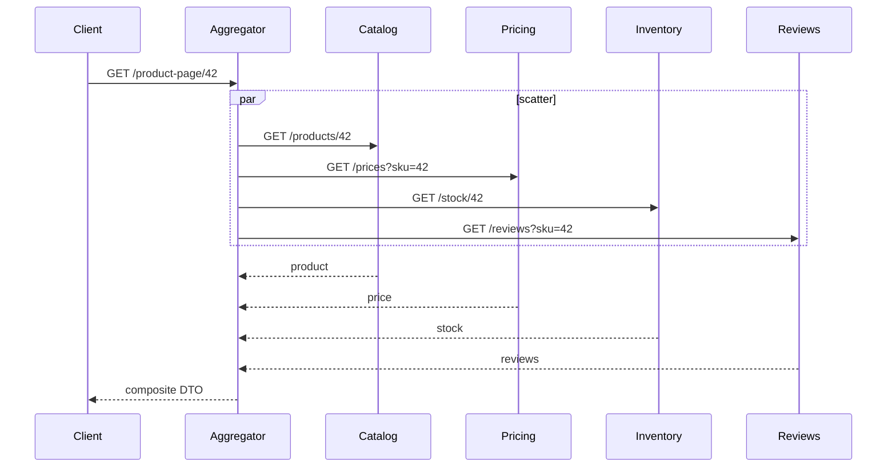
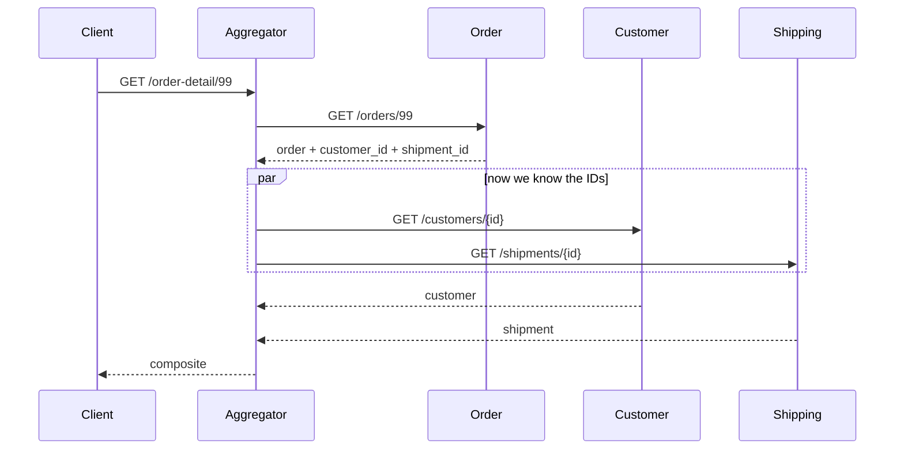
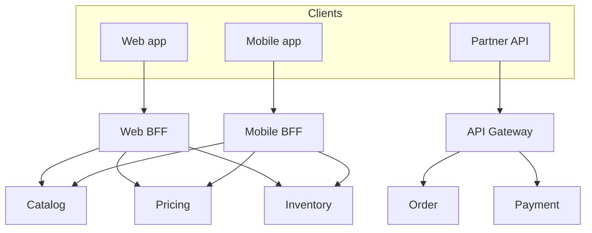
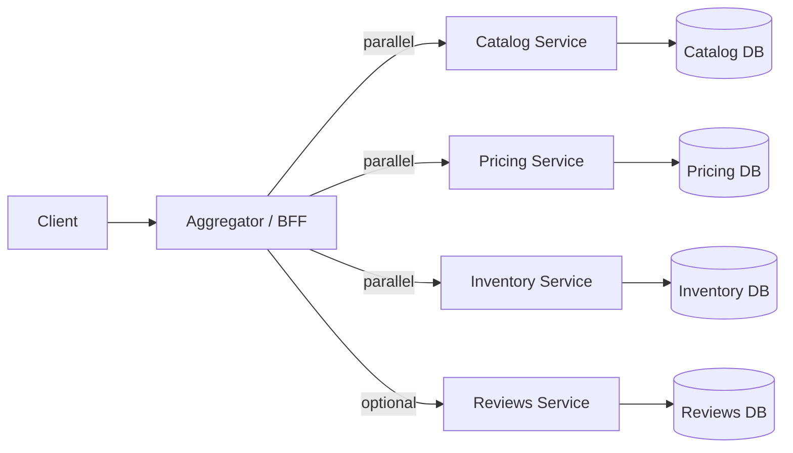

# Aggregator Pattern in Microservices — Detailed Study

Starting reference: [Aggregator Pattern walkthrough](https://youtu.be/6W8FCW2rWNQ?si=4_8bWjwCjcKt4QNd)

This note is a mid-to-senior study of the **Aggregator Pattern**: a service (or BFF / gateway) that calls several downstream microservices, **combines** their responses, and returns **one** composite payload to the client. It is the read-side answer to Database per Service. It is **not** a saga.

Related local notes: `Database_per_service.md` (why you cannot JOIN across services), `Circuit_Breaker_Pattern.md` (timeouts, bulkheads, fallbacks on each downstream), `Saga_Pattern.md` (writes that span services — different problem), `Event-Driven_Architecture.md` (CQRS / read models as the *other* way to compose), `Service_Discovery_Pattern.md` (how the aggregator finds those downstreams).

---

## 1. What it is

After you split a monolith, no single service owns a screen. A product page needs Catalog + Pricing + Inventory + Reviews. A dashboard needs Orders + Payments + Shipments. The client should not become the composition engine.

**Aggregator:** a component that:

1. Receives **one** client request (`GET /product-page/42`).
2. Calls **multiple** downstream services (in parallel when it can, sequentially when it must).
3. **Merges** the results into one DTO / JSON document.
4. Returns that document. The client talks to **one** hop.

```
Client  →  Aggregator  →  Catalog
                       →  Pricing
                       →  Inventory
                       →  Reviews
        ←  one composite response
```

Chris Richardson calls the same idea **API Composition**. Microsoft catalogues it as **Gateway Aggregation**. Sam Newman’s **BFF (Backend for Frontend)** is an aggregator **scoped to one client type**. The names differ; the job is the same: **compose reads at the edge (or a dedicated query service), not in the browser and not by joining other teams’ databases.**

**What it is not:**

- Not a **saga**. A saga coordinates **writes** (local TX + compensate). An aggregator **reads and merges**. Mixing them is how checkout becomes a 12-second HTTP request that also refunds.
- Not **CQRS / a materialized view**. Those **pre-join** data into a store. The aggregator **joins at request time**.
- Not “the API gateway.” A gateway *can* aggregate; most production gateways should **route**. Aggregation is domain-shaped; routing is infrastructure.
- Not GraphQL by itself. GraphQL is a **query language + resolver graph** that *implements* composition. You can have an aggregator without GraphQL, and a GraphQL gateway that *is* an aggregator.

Interview-safe sentence: *The aggregator is a composition layer: one inbound call, several outbound calls, one merged response. Clients stay dumb; downstreams stay private.*

---

## 2. Why it exists

Database per Service killed the SQL JOIN. The data still has to meet on a screen. If you do not compose on the server, the **client** fans out.

| If the client fans out | What actually happens |
| --- | --- |
| **Chatty API** | Mobile: `GET /products/42`, then `/prices/42`, then `/stock/42`, then `/reviews?sku=42`. Four RTTs on a high-latency network. |
| **Latency multiplies** | Client serialises those calls (or you write Promise.all in every app). p99 is the **sum** (serial) or the **max** (parallel) **plus** the client’s own radio / TLS cost, four times. |
| **Coupling** | Android, iOS, web, and partner APIs all hardcode the same four URLs, auth, and merge rules. A new field means four client releases. |
| **Bandwidth** | Each service returns its full resource; the phone downloads four payloads and throws most of them away. |
| **Security / topology** | Clients should not know internal service names, mesh mTLS, or which pod is Inventory. That is an internal graph. |
| **Partial failure in the UI** | Four independent error states, four retries, four timeout policies — duplicated in every client. |

The aggregator **collapses the fan-out behind one SLA**. Internal calls are data-center / cluster RTTs (milliseconds). The expensive hop (mobile, partner WAN) happens **once**.

This is the same reason you do not expose Database per Service as “here are 40 REST resources, good luck.” Composition is a **first-class** design, not a UI leftover.

---

## 3. Two shapes: scatter-gather vs sequential

How you call downstreams is the whole performance and failure story.

### 3.1 Parallel scatter-gather (independent reads)

Downstream calls **do not depend** on each other. Fire them together; wait for all (or for the required subset); merge.

Classic: product page.

```
GET /product-page/42
  ├─ GET Catalog /products/42
  ├─ GET Pricing /prices?sku=42
  ├─ GET Inventory /stock/42
  └─ GET Reviews /reviews?sku=42
merge → { product, price, stock, reviews }
```

Latency ≈ **max**(downstream latencies) + merge CPU, not the sum. This is the shape you want.



### 3.2 Sequential composition (dependent reads)

Call B **needs data from** call A. You cannot scatter.

Classic: “order detail with customer and current shipment.”

```
GET /orders/99
  → Order Service  (need customer_id, shipment_id)
  → Customer Service (customer_id)
  → Shipping Service (shipment_id)
```

Latency **adds**. Two extra RTTs. This is where aggregators get slow and where people invent N+1.



**Hybrid is normal:** first hop sequential (need IDs), then parallel fan-out. Design the APIs so the first hop returns **everything you need to scatter** (IDs, not “call me again for line items one by one”).

### 3.3 Reduce sequential pain

| Technique | What it does |
| --- | --- |
| **Batch / bulk endpoints** | `GET /customers?ids=1,2,3` instead of N `GET /customers/{id}` |
| **Event-carried snapshot** | Order already stored shipping address at checkout — do not live-GET Customer for history |
| **Lookaside cache** | Cache customer profile in the aggregator (TTL, invalidate on events) |
| **Give up on live composition** | If the screen is always Order+Customer+SKU, a **read model** is cheaper than 3 sequential hops |

If step 2 always needs step 1’s write, you do not have an aggregator problem — you have a **saga** (`Saga_Pattern.md`).

---

## 4. Where it lives

Same pattern, three common homes. Pick by **who owns the screen** and **how fat the merge is**.

| Placement | What it is | Fits | Smell |
| --- | --- | --- | --- |
| **Dedicated aggregator / query service** | A service whose *job* is one (or a few) composite APIs: Product Page Service, Customer 360 | Heavy merge, reuse across channels, its own cache and SLO | Becomes a **god service** if it starts owning all reads for the company |
| **API Gateway** | Gateway calls several backends and stitches JSON (Spring Cloud Gateway filters, Kong, AWS API GW + mapping) | **Thin** stitch: 2–3 GETs, little logic, same for all clients | Gateway becomes the second monolith — transformations, workflows, retries-with-business-rules |
| **BFF per channel** | Web BFF, Mobile BFF, Partner BFF — each aggregates what **that** UI needs | Different payloads, chattiness, auth; GraphQL often sits here | Copy-paste merge logic across BFFs; fix by sharing a library **or** a dedicated query service for the truly shared composite |



**2026 default:**

- **Route** at the gateway (auth, rate limit, TLS, path).
- **Compose** in a **BFF** (per channel) or a **query service** (shared, fat, cached).
- Do **not** put sequential 5-step workflows in NGINX.

**BFF vs dedicated aggregator:** BFF is an aggregator **plus** client-specific shaping (strip fields, combine for one screen, mobile-sized images). A dedicated aggregator is a **reusable composite API** (`GET /product-aggregate/42`) that several BFFs may call. Both can exist: BFF → aggregator → domain services, but that is an extra hop — only if the composite is heavy and shared.

Interview-safe sentence: *Gateway routes; BFF shapes for one client; a query/aggregator service composes a domain read that several clients share. Do not dump all three jobs into one process.*

---

## 5. Architecture (happy path)



The aggregator has **no business database** for those domains (it may have a **cache**). It does not JOIN Catalog’s tables. It calls **APIs**. That keeps Database per Service intact.

Internal protocol can be HTTP, gRPC, or both. gRPC + protobuf is a common choice **behind** the aggregator (multiplex, smaller payloads); the client still sees one JSON REST (or GraphQL) call.

---

## 6. Related patterns (keep them distinct)

Interviews mash these together. Separate **mechanism** from **placement**.

| Pattern | Question it answers | Relation to aggregator |
| --- | --- | --- |
| **API Composition** (Richardson) | How do I implement a query that spans services? | **This pattern.** Aggregator is the usual name in talks; composition is the catalogue name. |
| **API Gateway** | How do clients enter the estate? | Gateway **may** aggregate; its primary job is routing, auth, limits. Aggregation in the gateway is optional and should stay thin. |
| **BFF** | How does *this* client get a tailored API? | A BFF **is** an aggregator for one channel. Not every aggregator is a BFF (a shared Product Page service is not “for frontend” only). |
| **CQRS / read model** | How do I serve a hot query **without** calling N services per request? | **Alternative** to live aggregation: subscribe to events, materialize a document, `GET` one store. Stale by design. |
| **Choreography** | Who runs the **next write** after an event? | Event-driven **write** coordination. An aggregator is a **synchronous read**. Do not “choreograph” a product page. |
| **Saga / orchestration** | How do I run a **multi-service write** with compensation? | Opposite side of the coin. Aggregator: GET and merge. Saga: POST and compensate. See §7. |
| **Scatter-gather** | Messaging: send one request to many workers, merge replies | Same **shape** as parallel aggregation; often used for search, quotes, bidding. Aggregator is scatter-gather over **HTTP/gRPC services**. |
| **GraphQL** | How does the client ask for a graph of fields? | The GraphQL **gateway/server** is an aggregator with a schema. Resolvers **are** the downstream calls. Same failure and N+1 problems. |

### Aggregator vs saga (the distinction interviewers want)

| | **Aggregator** | **Saga** |
| --- | --- | --- |
| Intent | **Read** composition | **Write** process |
| Typical verb | GET | POST / command |
| Consistency | Best-effort merge; stale/partial OK if designed | Eventual process consistency; compensate on failure |
| Failure | Omit optional fields, serve cache, 206/degraded JSON | Compensate committed steps; do not “merge a half checkout” |
| Client | One response with a page | `202` + poll / push; do not hold HTTP for warehouse |
| If you mix them | Checkout that also GETs 8 services and times out | Product page that “creates a reservation” as a side effect — surprise writes |

If the user **places an order**, that is a saga (or a single-service TX). If the user **views** the order with payment status and tracking, that is an aggregator (or a read model). Same nouns, different patterns.

**Choreography** is also not an aggregator: services emit `OrderPlaced`; email and search **react**. No client is waiting for a merged JSON. If you need a merged **now**, you aggregate or you read a projection that those events already built.

---

## 7. Failure handling (this is where seniors get hired)

An aggregator **multiplies** failure domains. Four downstreams → four ways to be slow or dead. The product question is: **which fields are required vs optional?**

| Field class | Downstream down / slow | Honest behaviour |
| --- | --- | --- |
| **Required** (cannot render without it) | Catalog for a PDP | Fail the request (4xx/5xx or 503). Do not invent a product. |
| **Optional / progressive** (reviews, recommendations, “also bought”) | Reviews timeout | Return the page **without** that block; `reviews: null` + `warnings: ["reviews_unavailable"]` |
| **Degraded but cached** (price, FX, inventory count with SLA) | Pricing 5xx | Serve **stale cache** with `price_as_of`; never a **guessed** price |
| **Must be live** (stock for “buy now”, payment status) | Inventory timeout | Fail that **action** or disable Buy; do not show “in stock” from a 10-minute cache unless the business agrees |

**Partial response:** return 200 with a body that marks missing sections, or 207/multi-status if you have a convention. Do not 500 the whole PDP because reviews are down — that is how optional features take down conversion.

**Timeouts:** each downstream call has **its own** timeout, **shorter** than the client’s remaining budget.

```
Client timeout: 800ms
Aggregator budget: 700ms
  Catalog:  200ms
  Pricing:  150ms
  Inventory: 150ms
  Reviews:  100ms  (optional — abandon and omit)
```

If you wait 2s for Reviews, you blew the mobile SLO even on a happy Catalog.

**Circuit breakers:** one breaker **per downstream** (and often per operation). Open Reviews → skip Reviews, do not skip Catalog. Shared one breaker for all outbound HTTP is how a dead Reviews cluster blacks out the product page. Details: `Circuit_Breaker_Pattern.md`.

**Bulkheads:** cap concurrent calls **per dependency** so a slow Inventory cannot exhaust the aggregator’s thread/connection pool and starve Catalog. Semaphore per client.

**Fallbacks:** cache, default, omit, fail. Same rules as the circuit-breaker note: **never invent a successful payment or “in stock.”**

**Hedged / backup requests:** if Catalog p99 is ugly, a hedged retry to another replica can help — **only** on idempotent GETs, with a cap, or you double load during an outage.

**Cancellation:** when the required call fails, **cancel** the optional in-flight calls (HTTP/2 RST, gRPC cancel). Do not let Reviews finish and hold a thread after you already decided to 503.

Interview-safe sentence: *Classify every composed field as required or optional. Timeout and isolate each dependency. Degrade optional; fail required. One open circuit must not take down unrelated fields.*

---

## 8. Performance

Aggregation is a **latency tax**. Pay it on purpose.

| Technique | Why |
| --- | --- |
| **Parallelise independent calls** | Cost is max, not sum. Sequential-by-accident (await in a loop) is the usual bug. |
| **Bulk / batch APIs** | One `GET /products?ids=` beats 50 GETs. Aggregators are where N+1 becomes a **cross-service** outage. |
| **Bulkheads + bounded pools** | Protect the aggregator from one slow client. |
| **Caching** | Cache **downstream GETs** (Redis, Caffeine) by key; cache the **composite** if it is hot and slightly stale is OK. Invalidate with events if you can (`ProductUpdated`). |
| **Request coalescing** (singleflight) | 200 concurrent `GET /product-page/42` → **one** fan-out, many waiters. Stops a thundering herd on a popular SKU. |
| **Payload shaping** | Ask downstreams for **fields you need** (sparse fieldsets, gRPC, GraphQL). Over-fetching inside the DC still burns CPU and JSON parse time. |
| **Connection reuse / HTTP/2 / gRPC** | Four TLS handshakes per page will dominate. |
| **Timeouts tighter than the user** | A slow optional call must not define p99. |
| **Avoid aggregator → aggregator** | A chain of compositors is a latency onion and a debug nightmare. |

**Data-center vs device:** 4 × 5ms internal is fine. 4 × 200ms on LTE is not. That is the entire justification for the pattern. Do not then add 150ms of sequential JSON mapping on a cold JVM and throw the win away.

---

## 9. Comparison: client composition vs GraphQL vs CQRS

| | **Client-side composition** | **Aggregator / BFF / API composition** | **GraphQL gateway** | **Materialized view / CQRS read model** |
| --- | --- | --- | --- | --- |
| Who merges | Browser / mobile | Server (one hop from client) | GraphQL server (resolvers) | Projector, ahead of time |
| Client round trips | N | 1 | 1 (query) | 1 (read the view) |
| Freshness | Live (N live calls) | Live (N internal calls) | Live (unless cached) | **Eventual** (lag SLA) |
| Mobile / WAN | Worst | Good | Good | Best latency |
| Over-fetch / under-fetch | You control per app; easy to over-fetch N APIs | Fixed DTO — can over-fetch for some screens | Client asks for fields — **under-fetch** solved; **N+1 resolvers** still a trap | View is shaped for one query; other screens need other views |
| Coupling | Every client knows every service | Clients know **one** API; aggregator knows downstreams | Schema is the contract; resolvers know downstreams | Clients know the view; writers emit events |
| Failure | N error UIs | Designed partials | Partial GraphQL errors (`errors[]` + data) | View may be stale or incomplete until catch-up |
| Write path | Still separate | Still separate | Mutations ≠ saga by themselves | Not a write path |
| Best fit | Tiny internal tools, 2 services, LAN | Product pages, dashboards, BFFs | Many clients, many shapes, same graph | Hot lists, search, “my orders”, high QPS |
| Cost | Simple backend, expensive clients | Extra service + SLO | Schema + DataLoader discipline | Duplicate data, projector ops |

**Rule of thumb:**

- Low QPS, few services, must be **live** → **aggregator**.
- Many UI shapes, same graph → **GraphQL as the aggregator** (with DataLoader / batching — otherwise you rebuilt N+1).
- High QPS, same screen always, can be **seconds stale** → **read model**.
- Client on LAN, 2 calls, throwaway admin UI → **client composition** is honest.

Do not aggregator-fan-out 12 services on every keystroke of a typeahead. That is a search index.

---

## 10. Trade-offs and pitfalls

| Pitfall | What it looks like | What to do |
| --- | --- | --- |
| **God aggregator** | One “Experience Service” that knows every domain, every screen, every write | Split by **page / bounded query**. BFFs stay thin. Fat queries become their own service or a read model |
| **Bottleneck / SPOF** | All mobile traffic through one under-scaled BFF | Scale out (stateless). Cache. Do not put session sticky unless you must |
| **N+1** | For each of 50 order lines, `GET /sku/{id}` | Batch APIs, DataLoader, or denormalize IDs into the first response |
| **Chatty internals** | Aggregator makes 20 sequential GETs | Redesign downstream APIs; or stop composing live — project a view |
| **Over-fetching** | Composite always includes reviews, recommendations, ads | Different endpoints or GraphQL; or flags (`?include=reviews`) |
| **Sequential by accident** | `await catalog; await price; await stock` | Parallelise; measure with traces (one parent span, sibling children) |
| **No partial-failure policy** | Reviews down → entire 500 | Required vs optional; breakers per dep |
| **Aggregation of writes** | BFF `POST` that charges, reserves, and emails in one request | That is a **saga** (or one service). BFF should **start** a process (`202`), not run it |
| **Joining databases** | Aggregator gets JDBC to three DBs “just for this dashboard” | Shared-database anti-pattern (`Database_per_service.md`). Use APIs or a warehouse |
| **Gateway soup** | Spring Cloud Gateway 3k lines of merge filters | Move composition to a service you can test and trace |
| **Timeout longer than the user** | Aggregator waits 10s, mobile already gone | Budget timeouts; abandon optional |
| **Missing observability** | “PDP is slow” with no per-downstream breakdown | Span per downstream; metrics: `agg.downstream.latency`, error, omitted_optional, cache_hit |
| **Double aggregation** | Mobile BFF → Product Aggregator → Catalog Aggregator | Flatten. Extra hops need a reason (auth boundary, reuse, cache) |

The pattern **concentrates** coupling in one place so clients do not have it. That concentration is a **feature** until the place is a monolith with a REST facade.

---

## 11. When to use it / when NOT to

**Use when:**

- A screen or API **needs data from more than one service**, and the client should not fan out (mobile, partners, public internet).
- The query is **moderate QPS**, must be **reasonably live**, and a full CQRS projection is not worth it yet.
- You can name **required vs optional** fields and give each downstream a timeout / breaker.
- Downstream teams can offer **batch** endpoints for list pages.

**Do not use when:**

- **One service already owns the data.** Composing Order+LineItems inside Order Service is a module, not an aggregator. Do not add a network hop to JOIN your own tables.
- You need a **write workflow** across services → **saga** (orchestrated or choreographed), not a GET-with-side-effects.
- The page is **very hot** and the join is stable → **materialized read model** / search index. Live N-way fan-out will not hit the SLO.
- You were about to give the aggregator **credentials to every database**. That is a shared DB, not composition.
- The “aggregation” is **one** downstream. That is a **proxy / gateway route**, not a pattern.
- You cannot operate timeouts, bulkheads, and partial responses. A naive `Promise.all` that 500s if any child fails is **worse** than a slightly chatty client for optional widgets.
- Greenfield **modular monolith**: compose in-process. Extract an aggregator when the data actually lives in other *services*.

Strangler note: a BFF/aggregator in front of **monolith + new Catalog** is a valid **temporary** composition (`Strangler_pattern.md`). Delete the monolith hop when Catalog owns the data.

---

## 12. Mental model for interviews (one paragraph)

*Database per Service means you cannot JOIN. Someone must compose. The aggregator (BFF, query service, or a thin gateway stitch) takes one client request, calls multiple services — in parallel if independent, sequentially if later calls need earlier IDs — merges the DTOs, and returns one response. Clients stay off the internal graph. It is a read pattern: degrade optional fields, fail required ones, timeout and circuit-break per downstream. It is not a saga (writes + compensate) and not a read model (that join happens ahead of time). Risks: god service, N+1, serial awaits, gateway-as-monolith. If one service already has the data, compose there. If the query is hot and can be stale, project a view instead.*

---

## 13. Interview questions (5–6 year bar)

### Q1: What is the Aggregator Pattern?

**Answer:** A service (or BFF/gateway) that handles **one** client request by calling **several** microservices, combining their responses, and returning a **single** composite payload. It exists so the client does not fan out across the internal estate.

### Q2: Why not let the mobile app call Catalog, Pricing, and Inventory itself?

**Answer:** Four WAN RTTs, four auth/error/timeout implementations, coupling to internal URLs, extra battery and bandwidth. Internal cluster RTT is cheap; LTE is not. Composition belongs behind one SLA.

### Q3: Scatter-gather vs sequential composition?

**Answer:** Scatter-gather: independent calls in **parallel**; latency ≈ max. Sequential: call B needs A’s result (IDs); latency **adds**. Hybrid: first call for IDs, then parallel. Accidental sequential `await` in a loop is a common production bug.

### Q4: Aggregator vs API Gateway vs BFF?

**Answer:** Gateway: front door (route, auth, limits); *may* do a thin aggregate. Aggregator: composition as a job. BFF: aggregator **for one client type** (web vs mobile payloads). Default: smart BFF or query service, dumb gateway.

### Q5: Aggregator vs saga?

**Answer:** Aggregator **reads and merges**. Saga **writes across services** with compensation. Do not run checkout as an aggregator POST that blocks on payment + stock + shipping. Do not use a saga to build a product page.

### Q6: Aggregator vs CQRS / materialized view?

**Answer:** Aggregator joins **at request time** (live, N calls). Read model joins **ahead of time** from events (fast GET, eventual consistency). Hot dashboards and search → view. Occasional, must-be-fresh screens → aggregator.

### Q7: What if Reviews is down — do you fail the product page?

**Answer:** No, if reviews are **optional**. Timeout Reviews independently, trip its breaker, omit the section, 200 the rest. If **Catalog** is down, fail the page. Classify fields up front.

### Q8: How do you keep the aggregator from becoming a god service?

**Answer:** One composite per **use case** (PDP, checkout summary), not one Experience Service for the company. Shared merge logic in a query service; channel differences in BFFs. If the join is huge and hot, **stop aggregating live** — build a read model. Do not put write workflows here.

### Q9: N+1 in an aggregator?

**Answer:** List of 50 orders, then 50 customer GETs, then 50 payment GETs. Fix: batch APIs, embed IDs and snapshots on the order, DataLoader, or a list **read model**. Cross-service N+1 is worse than SQL N+1 (RTT + failure domain per call).

### Q10: Where do circuit breakers sit?

**Answer:** On **each** downstream client inside the aggregator (and bulkheads per dep). Gateway-level breaker is coarse. Mesh outlier ejects a **pod**; the aggregator still decides “skip Reviews vs fail PDP.” See `Circuit_Breaker_Pattern.md`.

### Q11: Is GraphQL a replacement?

**Answer:** GraphQL **is** an aggregator with a schema. You still have resolvers, N+1 (DataLoader), timeouts, and partial errors. It solves over/under-fetch for many clients; it does not magically make 12 sequential resolvers fast.

### Q12: When would you refuse the aggregator?

**Answer:** Data already in one service; the operation is a **write saga**; QPS too high for live fan-out (use a view); team would JDBC-join three DBs; only one downstream (that is routing).

### Q13: How do you test it?

**Answer:** Contract tests on each downstream. Unit-test merge + required/optional matrix (Reviews 500 → body without reviews; Catalog 500 → 503). Chaos: timeout one dep, open a breaker, assert cancellation of optional calls. Load-test **parallel** vs accidental serial. Trace asserts sibling spans, not a chain.

### Q14: Request coalescing?

**Answer:** Concurrent identical GETs share **one** fan-out (singleflight). Protects popular keys and cache expiry storms. Must still be correct for auth-scoped data (do not coalesce user A’s cart with user B’s).

### Q15: Can the aggregator write?

**Answer:** It can **issue** a command (`POST /orders` to start a saga) and return `202` + id. It should not **orchestrate compensation** inline on the HTTP thread. Reads compose; writes start processes.

### Q16: Choreography vs aggregator for “order + email + search index”?

**Answer:** Email and search are **async reactions** to `OrderPlaced` (choreography / events). The **order confirmation screen** might aggregate Order + Payment status. Do not wait for email in the aggregator.

---

## 14. Further reading

- Chris Richardson — [Pattern: API composition](https://microservices.io/patterns/data/api-composition.html) (the catalogue name for this)
- Chris Richardson — [Pattern: API gateway](https://microservices.io/patterns/apigateway.html) and [Backends for frontends](https://microservices.io/patterns/apigateway.html) (BFF as a variant)
- Microsoft Learn — [Gateway Aggregation](https://learn.microsoft.com/en-us/azure/architecture/patterns/gateway-aggregation)
- Sam Newman — *Building Microservices* (BFF, composition vs choreography)
- GraphQL — [DataLoader](https://github.com/graphql/dataloader) (batching / N+1 in a graph aggregator)
- Related: `Database_per_service.md` §6–7 (how services share data; you cannot JOIN), `Saga_Pattern.md` (writes), `Circuit_Breaker_Pattern.md` (per-downstream isolation), `Event-Driven_Architecture.md` (CQRS / read models as the alternative join)
