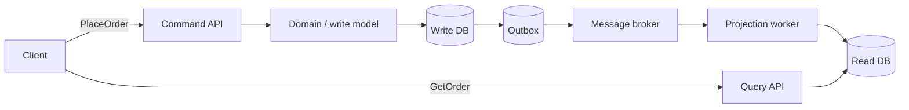

# CQRS Pattern in Microservices — Detailed Study

Starting reference: [CQRS pattern walkthrough](https://youtu.be/SvjdJoNPcHs?si=OMQJji5BSeWInSSr)

**CQRS** stands for **Command Query Responsibility Segregation**. It separates operations that **change state** (commands) from operations that **read state** (queries), allowing each side to use a model, API, database, and scaling strategy suited to its job.

---

## 1. The core idea

In a traditional CRUD service, the same model usually handles reads and writes:

```text
Client → Order API → Order model → Orders database
             │
             ├── POST /orders       (write)
             ├── PATCH /orders/123  (write)
             └── GET /orders/123    (read)
```

CQRS separates these responsibilities:

```text
                         ┌─ Command handler ─ Write model ─ Write database
Client ─ API / Gateway ──┤
                         └─ Query handler ─── Read model ── Read database
```

- A **command** expresses an intention to change state: `PlaceOrder`, `CancelOrder`, or `ChangeAddress`.
- A **query** asks for data and must not change business state: `GetOrder`, `SearchOrders`, or `GetCustomerOrderHistory`.
- The **write model** enforces business rules and owns authoritative state.
- The **read model**, also called a **projection**, is shaped for efficient retrieval and presentation.

Interview-safe sentence: *CQRS separates the write path, which validates commands and protects business invariants, from the read path, which returns purpose-built views. The two sides may share a database, but at scale they often use separate stores synchronized asynchronously.*

---

## 2. Why use CQRS in microservices?

Read and write workloads usually have different requirements:

| Write side | Read side |
| --- | --- |
| Enforces business invariants | Optimizes response time |
| Usually normalized domain data | Often denormalized display data |
| Needs transactions and concurrency control | May tolerate slightly stale data |
| Scales by command throughput | Scales by query throughput |
| Domain-oriented schema | UI- or consumer-oriented schema |
| Usually fewer, more expensive operations | Often many simple operations |

For example, placing an order must check inventory, validate its state transition, calculate totals, and prevent duplicate submission. Displaying an order page needs a fast view containing order lines, product names, payment status, and shipping progress. One data model rarely serves both needs well.

CQRS lets a team:

1. **Scale reads and writes independently.** A product catalogue may receive thousands of reads for every write.
2. **Optimize storage independently.** PostgreSQL can protect write-side transactions while Elasticsearch supports read-side search.
3. **Use task-specific models.** The domain model protects invariants; the read model matches the exact response needed by a screen.
4. **Improve write-side design.** Commands represent business intent instead of generic row updates.
5. **Precompute expensive views.** Joins and aggregations happen while building a projection rather than during every request.

These benefits have a cost: extra components, duplicated data, synchronization logic, and often eventual consistency.

---

## 3. Commands and queries

### 3.1 Command

A command is an imperative request to perform a business action:

```json
{
  "commandId": "cmd-7e91",
  "type": "PlaceOrder",
  "customerId": "C-42",
  "items": [
    {"productId": "P-10", "quantity": 2}
  ]
}
```

A command:

- Can be accepted or rejected.
- Should be named after business intent, not a database operation.
- Is handled once logically, so retries require **idempotency**.
- May return an acknowledgement, identifier, or validation error.
- Should not return a large read model as its main purpose.

Prefer `CancelOrder(orderId, reason)` over `UpdateOrder(status="cancelled")`. The first communicates intent and lets the domain reject cancellation after shipment; the second exposes storage fields and can bypass rules.

### 3.2 Query

A query asks for information:

```http
GET /customers/C-42/orders?status=SHIPPED
```

A query:

- Must not produce business side effects.
- Can use a model designed specifically for the consumer.
- Can safely be retried and cached.
- May read denormalized or duplicated data.

Logging and metrics are operational effects and do not violate this rule. Charging a card, changing an order, or publishing a business event from a query does.

---

## 4. CQRS implementation levels

CQRS does **not** automatically mean two databases or event sourcing. It can be introduced progressively.

### Level 1: Separate code paths, one database

```text
Command handlers ─┐
                  ├── PostgreSQL
Query handlers ───┘
```

Commands and queries have separate handlers and models but use the same database. This provides clearer code with minimal operational complexity. Read-after-write consistency remains straightforward.

### Level 2: Separate schemas or tables

```text
Command handlers → normalized write tables
Query handlers   → denormalized read tables
                         (same DB server)
```

The read tables are projections updated in the same transaction or by a background worker.

### Level 3: Separate databases

```text
Command → Write service → Write DB
                           │
                         events
                           ▼
                    Projection worker → Read DB → Query service
```

This enables independent scaling and different database technologies. It also introduces replication delay and failure modes.

Choose the simplest level that solves a measured problem. Splitting databases on day one is not required to claim CQRS.

---

## 5. Typical request flow

Consider an order service:

```text
1. Client sends PlaceOrder with an idempotency key.
2. Command handler validates syntax and authorization.
3. Order aggregate checks business rules.
4. Write DB commits the new order.
5. An OrderPlaced event is published reliably.
6. Projection consumer receives OrderPlaced.
7. Consumer updates the order_summary read model.
8. Queries now return the new order.
```

The important gap is between steps 4 and 7. During that interval, the write succeeded but the read model may not show it yet. This is **eventual consistency**.



---

## 6. Keeping read models synchronized

### 6.1 Synchronous update

The command updates the write model and read model before returning.

**Advantage:** immediate read-after-write behavior.

**Problem:** if the stores are separate, this creates a distributed dual write. The write DB can commit while the read DB update fails, leaving inconsistent data.

### 6.2 Asynchronous events

The write side commits authoritative state and publishes an event. Consumers build one or more read models.

**Advantages:**

- Write latency does not include projection work.
- Multiple independent projections can subscribe.
- A projection can be rebuilt by replaying retained events.

**Problems:**

- Reads can be stale.
- Messages can be delayed, duplicated, or delivered out of order.
- Projection failures need monitoring, retries, and repair.

### 6.3 Transactional outbox

Writing domain state and directly publishing to a broker is another unsafe dual write:

```text
Database commit succeeds → broker publish fails → read model never learns
Broker publish succeeds   → database commit fails → event describes nonexistent state
```

The **transactional outbox** solves this by storing the state change and an outbox message in the same local database transaction. A relay later publishes the outbox message to the broker.

```text
Local transaction:
  INSERT INTO orders ...
  INSERT INTO outbox ...
  COMMIT

Relay:
  read unpublished outbox rows → publish → mark as published
```

Delivery is normally **at least once**, so projection consumers must be idempotent.

---

## 7. Designing reliable projections

A projection transforms events into a query-friendly view:

```sql
CREATE TABLE order_summary (
    order_id         VARCHAR PRIMARY KEY,
    customer_name    VARCHAR NOT NULL,
    total_amount     DECIMAL NOT NULL,
    payment_status   VARCHAR NOT NULL,
    shipping_status  VARCHAR NOT NULL,
    last_event_seq   BIGINT NOT NULL
);
```

Production projections should handle:

- **Duplicates:** store processed event IDs or apply naturally idempotent upserts.
- **Ordering:** use an aggregate version or sequence number and reject older updates.
- **Retries:** retry transient errors with backoff; route persistent failures to a dead-letter queue.
- **Schema evolution:** version event contracts and keep consumers compatible during deployment.
- **Rebuilds:** support replay into a new table/index before switching query traffic.
- **Lag:** measure broker lag and the age of the last applied event.

Example idempotency rule:

```text
Apply event only when event.orderVersion > row.last_event_seq
```

Exactly-once processing is rarely an end-to-end guarantee. A safer design assumes redelivery and makes every update idempotent.

---

## 8. Handling eventual consistency in the user experience

After a successful command, an immediate query can return old data. Common approaches are:

1. **Return the created resource ID and status.** The UI shows “Order accepted; processing.”
2. **Poll until a version appears.** The command returns version `18`; the client queries until the projection reports at least version `18`.
3. **Read from the write store for a narrow endpoint.** Use this only when strong read-after-write consistency is essential.
4. **Update the UI optimistically.** Roll back the local view if the command is rejected.
5. **Push completion to the client.** WebSocket or server-sent events notify the UI after projection.

Never hide this consistency model from product design. A UI that says “not found” immediately after reporting “created” looks broken even if the architecture is technically functioning.

---

## 9. CQRS and event sourcing are different

These patterns are frequently confused:

| CQRS | Event sourcing |
| --- | --- |
| Separates command and query models | Stores state as an append-only sequence of events |
| Can use ordinary current-state tables | Reconstructs current state by replaying events |
| May use one or multiple databases | Requires an event store as the source of truth |
| Solves read/write model mismatch | Preserves the complete history of state changes |

They work well together but neither requires the other:

- **CQRS without event sourcing:** update the current `orders` row, write an outbox event, and update a read projection.
- **Event sourcing with CQRS:** command handlers append domain events; aggregates and read projections are rebuilt from those events.

Using events only to synchronize a read database does not automatically make the system event-sourced. In event sourcing, the event log—not a current-state table—is authoritative.

---

## 10. Relationship to microservice boundaries

CQRS is an internal architecture choice; it does not justify splitting every command and query into separate deployable microservices.

A common design is:

```text
Order bounded context
  ├── Command API
  ├── Domain model
  ├── Write DB
  ├── Projection consumer
  ├── Query API
  └── Read DB
```

The command and query APIs may be separate deployments when their scaling or availability needs differ, but they still belong to the same **bounded context**. Their contracts and data ownership must remain clear.

A service should not query another service’s private write database to build its views. It should consume published events or call a supported API. Otherwise, database-level coupling defeats service autonomy.

---

## 11. Benefits and costs

### Benefits

- Independent read/write scaling.
- Fast, purpose-built query models.
- Clear business commands and domain boundaries.
- Isolation of complex write rules from presentation concerns.
- Freedom to use different storage technologies.
- Multiple read models for different consumers.
- Better fit for event-driven integration and audit-heavy domains.

### Costs

- More code, infrastructure, stores, and deployment units.
- Eventual consistency becomes visible to users and developers.
- Duplicate and out-of-order message handling is mandatory.
- Event contracts require careful evolution.
- Debugging spans the API, broker, projector, and read store.
- Rebuilding large projections can take significant time.
- Data deletion and privacy requirements must cover every replica.

CQRS shifts complexity; it does not remove it.

---

## 12. When to use it

CQRS is a good fit when:

- Read volume is much higher than write volume, or each side scales differently.
- Read screens require expensive joins, search, or aggregations.
- The write domain has meaningful invariants and complex workflows.
- Different consumers need significantly different representations.
- Eventual consistency is acceptable and can be communicated.
- The team can operate brokers, projections, retries, and monitoring.

Avoid full CQRS when:

- The service is simple CRUD.
- Read and write models are almost identical.
- Strong consistency is required for nearly every query.
- Traffic is low and the current database performs well.
- The team lacks a reliable messaging and observability platform.

Starting with separate command/query code paths in one service is often enough. Split stores only after workload or modeling requirements justify it.

---

## 13. Common mistakes

1. **Treating every POST as CQRS.** Separate HTTP verbs alone are not CQRS; the models and responsibilities must be intentionally separated.
2. **Using generic update commands.** `UpdateEntity` loses business meaning and weakens invariant enforcement.
3. **Performing an unsafe dual write.** Use an outbox or change-data capture instead of “save, then publish.”
4. **Assuming exactly-once delivery.** Design consumers for duplicates and retries.
5. **Sharing write tables with query consumers.** This couples the read workload and schema back to the write model.
6. **Ignoring projection lag.** Monitor it and define what users see while data catches up.
7. **Putting business actions in query handlers.** Queries should not change domain state.
8. **Adopting event sourcing unnecessarily.** CQRS can use ordinary relational state.
9. **Creating one universal read model.** Consumer-specific projections are often the point.
10. **Using CQRS everywhere.** Apply it to bounded contexts whose complexity or workload earns the operational cost.

---

## 14. Practical order example

### Command side

```python
def handle_place_order(command):
    if processed_commands.exists(command.command_id):
        return processed_commands.result(command.command_id)

    order = Order.place(
        customer_id=command.customer_id,
        items=command.items,
    )

    with transaction():
        orders.save(order)
        outbox.add(
            event_type="OrderPlaced",
            aggregate_id=order.id,
            aggregate_version=order.version,
            payload=order.to_event_payload(),
        )
        processed_commands.record(command.command_id, order.id)

    return {"orderId": order.id, "status": "ACCEPTED"}
```

### Projection side

```python
def on_order_placed(event):
    current = order_summary.get(event.order_id)

    if current and current.last_event_seq >= event.aggregate_version:
        return  # duplicate or stale event

    order_summary.upsert(
        order_id=event.order_id,
        customer_name=event.customer_name,
        total_amount=event.total_amount,
        status="PLACED",
        last_event_seq=event.aggregate_version,
    )
```

### Query side

```python
def get_order_summary(order_id):
    return order_summary.get(order_id)
```

The command side protects order rules. The projection side turns facts into a view. The query side simply returns that view.

---

## 15. Production checklist

- [ ] Commands express business intent and include an idempotency key.
- [ ] The write model is the documented source of truth.
- [ ] State and outbound events are committed atomically through an outbox or equivalent.
- [ ] Consumers handle duplicate and out-of-order messages.
- [ ] Event contracts are versioned and backward compatible.
- [ ] Projection lag, failures, retries, and dead-letter queues are observable.
- [ ] Read models can be rebuilt without stopping the write path.
- [ ] The API communicates pending or stale states clearly.
- [ ] Authorization is enforced independently on command and query APIs.
- [ ] Personal-data deletion covers write stores, read stores, caches, events, and backups.
- [ ] Disaster recovery tests include rebuilding projections.

---

## 16. Quick interview summary

**What is CQRS?**  
CQRS separates commands that modify state from queries that read state, giving each side its own model.

**Does CQRS require two databases?**  
No. It can begin as separate code paths over one database. Separate stores are an optional advanced form.

**How are two stores synchronized?**  
Usually through domain or integration events, reliably published with a transactional outbox and consumed by idempotent projection handlers.

**What is the main trade-off?**  
Independent optimization and scaling in exchange for operational complexity and eventual consistency.

**Is CQRS the same as event sourcing?**  
No. CQRS separates responsibilities; event sourcing stores state as events. They can be used independently or together.

**When should it be avoided?**  
For straightforward CRUD systems where one model performs well and strong read-after-write consistency matters more than independent scaling.
