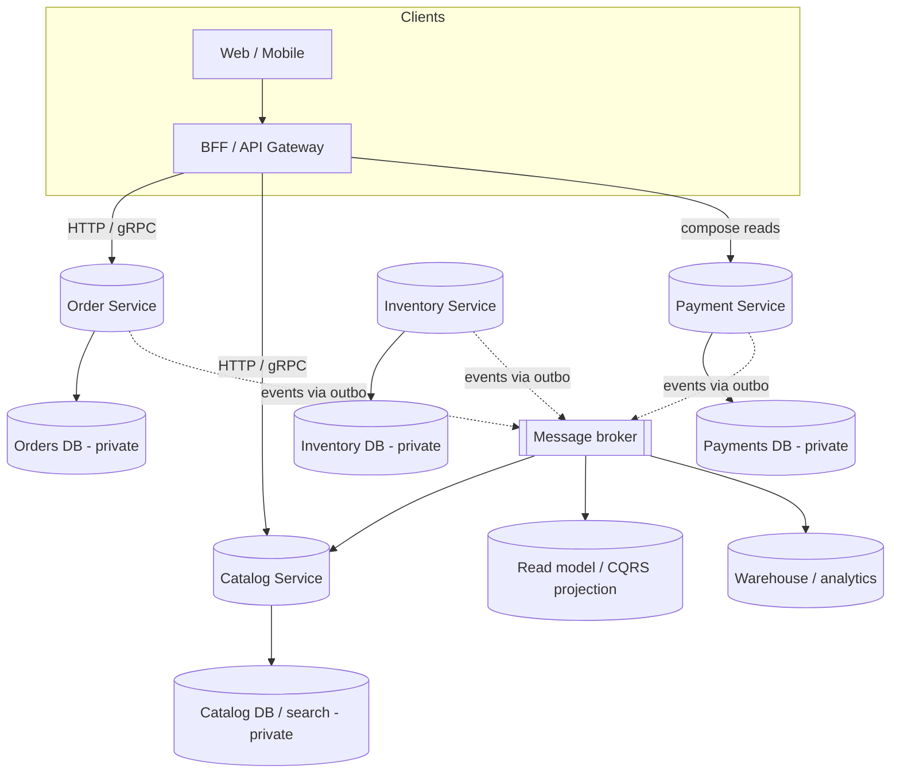
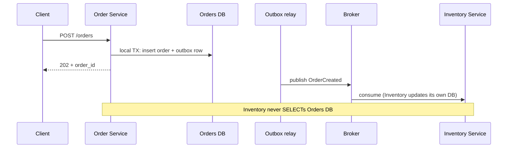

# Database per Service Pattern in Microservices — Detailed Study

Starting reference: [Database per Service walkthrough](https://youtu.be/DKQLhy9bgdk?si=riS63eHgOUUz80BS)

This note is a mid-to-senior study of the **Database per Service** pattern: each microservice owns its data and no other service reads or writes that store directly. It is the data counterpart of independent deploy. It is also why microservices lose a single ACID transaction and pick up sagas, events, and composition.

Related local notes: `Saga_Pattern.md` (how you coordinate writes once there is no shared TX), `Event-Driven_Architecture.md` (outbox, dual-write, CQRS/read models), `Strangler_pattern.md` (shared DB as a failed extract), `DISTRIBUTED_system.md` (CAP, dual-write).

---

## 1. What it is

**Database per Service:** each microservice is the **only** process allowed to read and write its persistent data. Other services get that data through the owner’s **API**, **events**, or an **explicitly published** read model — never by connecting to the owner’s tables.

Chris Richardson’s formulation: the database is **private** to the service. “Private” is a **boundary**, not a hardware rule. Two services on the same Postgres *cluster* with **separate databases (or schemas) and no cross-schema SQL** still satisfy the pattern. Two services sharing `orders` and `inventory` tables do **not**, even if they are separate deployables.

```
Order Service  →  Orders DB          (only Order talks to it)
Payment Service → Payments DB        (only Payment talks to it)
Inventory Service → Inventory DB     (only Inventory talks to it)
Catalog Service → Catalog DB / search index
```

The pattern is **data encapsulation**. A service that cannot change its schema without coordinating five other teams is not independently deployable, no matter how many Kubernetes deployments you drew.

**What it is not:**

- Not “every service must have its own physical server / RDS instance.” That is an ops choice.
- Not “never query more than one service.” Cross-service *reads* happen; they happen **above** the DB (composition, events, warehouse).
- Not “polyglot persistence is mandatory.” You can run five Postgres databases. Polyglot is optional; **private ownership** is not.

---

## 2. Why it exists

A microservice that does not own its data is a **distributed monolith**: many processes, one schema, one lock, one migration train.

Owning the store buys:

| Benefit | What you actually get |
| --- | --- |
| **Loose coupling** | Schema, indexes, and invariants live in one team. Other teams couple to a **contract** (API/event), not to columns. |
| **Independent deploy** | You can add a column, change a type, or migrate storage without a company-wide freeze. |
| **Independent scale** | Catalog can be a read replica / Elasticsearch cluster; Payments can be a small, highly available ledger. You scale the hot store, not the whole estate. |
| **Independent failure** | A Catalog DB outage does not lock Order’s checkout tables (it may still break composition — that is a different layer). |
| **Right store for the job** | Polyglot persistence: document DB for catalog, relational for orders, Redis for sessions, time-series for metrics. |
| **Bounded context integrity** | The service enforces its invariants in one place. Inventory cannot “just UPDATE orders.status.” |

Interview-safe sentence: *Services that share a database share a schema, a release, and a failure domain. Database per Service is how you make the service boundary real.*

---

## 3. Shared database: the anti-pattern

The **shared database** (one schema, many services, SQL across team boundaries) is the default “we split the process but not the data” failure.

```
Order Service ──┐
Payment Service─┼──→  One shared schema (orders, payments, stock, users, …)
Inventory Service┘
```

What goes wrong:

| Symptom | Why it happens |
| --- | --- |
| **Schema fights** | Order needs `status` as an enum; Reporting needs a free-text column; both own the table. Migrations become politics. |
| **Cannot evolve independently** | Adding an index for Catalog’s p99 slows Payment’s writes. You cannot ship a breaking column change. |
| **Hidden coupling** | A JOIN in Reporting encodes Inventory’s model. Change a FK and you break a service that never declared a dependency. |
| **Runtime coupling** | Long reporting queries lock checkout rows. One team’s batch job is another’s incident. |
| **Unclear ownership** | Who is allowed to `UPDATE stock`? Both Order and Inventory, so neither is correct. Invariants leak into “whoever wrote the query.” |
| **Distributed monolith** | You paid network + ops cost and kept a single deploy risk. Sam Newman: if you share the DB, you have not decomposed the system. |

Shared DB is sometimes an **honest temporary** step during strangling (new process, old tables). It is not an architecture. If the extract never moves the tables, you extracted a process, not a service. See `Strangler_pattern.md` §5.

**Private schema on a shared server** is *not* this anti-pattern. Shared **tables** are.

---

## 4. Data ownership and bounded contexts

Ownership follows **bounded context**, not “every noun gets a table in a central ERD.”

- **Order** owns order lifecycle, line items, and order-local status.
- **Inventory** owns SKUs, stock counts, reservations.
- **Payment** owns charges, refunds, ledger entries.
- **Catalog** owns product presentation, search documents.

A customer *appears* in several contexts. That is normal. Each service stores **the slice it needs**, keyed by a stable ID (`customer_id`). Order does not own the customer profile; it stores a reference and maybe a snapshot of the shipping address at order time. Profile changes after checkout do not rewrite history unless the business says they should.

**Rules of ownership:**

1. **One writer.** Only the owning service mutates the source of truth. Replicas and read models are derived.
2. **Invariants stay local.** “You cannot reserve more stock than on hand” lives in Inventory, not in a JOIN from Order.
3. **IDs are the public contract.** Other services know `order_id` / `sku_id`, not `orders.fk_warehouse_bin`.
4. **Snapshots at the boundary.** When Order needs “price at checkout,” it copies the price into the order. It does not live-JOIN Catalog forever.

If two services must **always** commit together to keep an invariant true, they probably belong in **one** service (or one modular monolith module). Database per Service does not mean split every table.

---

## 5. Architecture



Happy-path write stays **inside one service**:



No service opens a connection to another service’s database. The JOIN you used to write in SQL is now **composition or an event-fed copy**.

---

## 6. How services share data (without sharing the DB)

You replaced foreign keys with **integration**. Pick the mechanism that matches the question.

| Mechanism | When it is honest | Cost |
| --- | --- | --- |
| **Synchronous API** | Caller **must** have an answer in this request: “is this SKU in stock *right now*?”, quote, authz | Temporal coupling; cascading failure; N+1 if you chat | 
| **Events / pub-sub** | Other services react to a **fact** (`OrderPlaced`, `StockReserved`). Producer should not know the full consumer list | Eventual consistency; schema of events becomes the contract |
| **CQRS / read models** | A query shape that is not any one service’s write model (order history + payment status + SKU name on one screen) | Duplicate data, lag, “which copy is truth?” |
| **Saga** | A **write** that spans services (checkout: charge + reserve + ship) | No global ACID; compensation; see `Saga_Pattern.md` |
| **BFF / API composition** | Edge assembles a page from several GETs | Extra hops; partial failure (what if Payment is down?) |
| **Data warehouse / lake** | Reporting, ML, finance close — **not** the live checkout path | ETL lag; not a source of truth for writes |

**Default production stack:** local ACID in the owner → **transactional outbox** → events for everyone who can be async → **API** for the few questions that must be live → **saga** only for the multi-service write → warehouse for analytics.

Do not invent a “shared reporting schema” that checkout also writes. That is the anti-pattern with a nicer name.

---

## 7. Querying across services (you cannot JOIN)

The interview trap: *“How do I get orders with customer name and current stock?”*

In a monolith: `SELECT … JOIN customers JOIN inventory`. Across Database per Service you **do not** JOIN service databases. Options:

| Pattern | How it works | Fits |
| --- | --- | --- |
| **API composition** | BFF or a query service calls Order, then Customer, then Inventory; merges in memory | Low volume, simple screens, tolerate extra latency |
| **BFF per client** | Mobile BFF and web BFF each compose what that UI needs | Different payloads; keep composition out of the domain services |
| **Materialized view / CQRS** | Subscribe to `OrderPlaced`, `CustomerUpdated`, `StockChanged`; maintain a denormalized store for that screen | Hot dashboards, search, “my orders” lists |
| **Event-carried state transfer** | Fat events so consumers keep a **local copy** of the slice they need | Avoid callback storms; accept stale copies |
| **Data warehouse** | CDC / ETL from each service DB into Snowflake/BigQuery/Redshift | BI, regulatory reports, “join everything” |

**Partial failure:** composition must define degraded UI (“payment status unavailable”), timeouts, and bulkheads — same as any sync graph (`Circuit_Breaker_Pattern.md`).

**N+1 across services** is worse than N+1 SQL: each extra call is a network RTT and a failure domain. If the screen always needs Order+Customer+SKU, a **read model** is cheaper than 3×N HTTP.

**Never:** a “clever” user that has credentials to all three DBs and JOINs in a fourth service. That is a shared database with extra steps.

---

## 8. Consistency: local ACID, eventual everywhere else

Inside one service, keep using transactions. That is the point of owning the DB.

Across services you **cannot** have one isolation level. Consequences:

| Scope | What you get |
| --- | --- |
| **One service, one DB** | ACID. Enforce invariants here. |
| **Two services, one business process** | **Eventual consistency.** Intermediate states are visible (`PENDING` order, payment captured, stock not yet reserved). |
| **Global JOIN / report** | Stale or incomplete unless you wait for projections. |

This is **why sagas exist**. A monolith wrapped checkout in one TX. Database per Service made that TX impossible (no shared locks, no honest 2PC across Postgres + Stripe + Mongo). You sequence local transactions and **compensate** when a later step fails. Full treatment: `Saga_Pattern.md`.

Interview-safe sentence: *Each service is strongly consistent with itself. The platform is eventually consistent between services. If you need a multi-row invariant to be atomic, keep those rows in one service.*

**CAP in one line:** when you split data, a partition between Order and Inventory means you choose stale stock vs refusing checkout. Design the choice; do not pretend the JOIN still exists.

---

## 9. Polyglot persistence

Martin Fowler: **polyglot persistence** is using **different data stores** for different needs — not using five databases as a fashion.

| Service | Store that often fits | Why |
| --- | --- | --- |
| Orders / payments | Relational (Postgres) | Transactions, constraints, audit |
| Catalog / CMS | Document (Mongo, JSONB) | Sparse, evolving attributes |
| Search | Elasticsearch / OpenSearch | Relevance, full text |
| Sessions / cache | Redis | TTL, speed |
| Relationships | Graph (Neo4j) | Recommendations, fraud rings |
| Metrics | Time-series | High ingest, downsample |

**When it helps:** the access pattern is genuinely different (search vs ledger), and the team can operate the extra system (backups, failover, schema, on-call).

**When it is a tax:** three services, all CRUD, all fine in Postgres — then three Postgres **databases** (or schemas) are enough. Each extra engine is another backup story, another CVE, another person who knows how it fails at 3am.

Polyglot is an **optimization on top of ownership**. Ownership is the pattern. “We use Mongo because microservices” is not a reason.

---

## 10. Implementation notes

**Private schema even on one server.** Cost, compliance, or early-stage ops often means one Postgres cluster. Create `order_svc`, `payment_svc` databases (or schemas) with **separate credentials**. No `SELECT` grants across them. Treat a cross-schema query as a production incident, same as opening another team’s RDS.

**Never share tables.** Views that other services query are still shared schema. A read-only replica of *your* DB consumed only by *your* query service is fine. A replica that Inventory uses to JOIN orders is not.

**Transactional outbox for events.** After a local commit you almost always must tell others. Doing `COMMIT` then `kafka.send` is the **dual-write** bug: crash in between and the world never hears. Write the business row and an `outbox` row in the **same** local transaction; a relay or CDC (Debezium) publishes later. Do not put the outbox in a different database than the business tables. Details: `Event-Driven_Architecture.md` §5–7.

**Idempotent consumers.** Brokers retry. The other side of ownership is: when you *consume* someone else’s event, apply it once in *your* DB (inbox / idempotency key).

**One writer for the source of truth.** CDC into a warehouse or search index is a **copy**. Search is not allowed to be the only place stock exists.

**Migrations belong to the service.** Expand/contract (add column, dual-write in-process, then drop) so you do not require lockstep deploys with consumers. Event schemas version the same way.

**Access control as the real fence.** Pattern diagrams do not stop a leaked JDBC URL. Network policies, IAM, and no shared “app” user are part of the implementation.

---

## 11. Trade-offs and pitfalls

| Pitfall | What it looks like | What to do |
| --- | --- | --- |
| **Distributed transactions** | “Just 2PC checkout” or ad-hoc reverse HTTP on failure | Saga + outbox + compensation; or **don’t split** that invariant |
| **N+1 across services** | BFF loops `GET /orders/{id}` then `GET /customers/{id}` per row | Batch APIs, or a read model for that screen |
| **Reporting pain** | Finance wants a JOIN that no longer exists | Warehouse / CDC; do not give BI credentials to all prod DBs |
| **Dual-write** | App writes DB and Kafka (or DB and Elasticsearch) in two steps | Outbox or CDC; reconciliation job as safety net |
| **“Shared DB for convenience”** | “Just this one JOIN for the deadline” | It becomes the architecture. Time-box and reverse it, or admit a modular monolith |
| **Chatty sync** | Every page hits 8 services | Events + local copies for non-critical fields; compose only what must be live |
| **God composition layer** | Gateway JOINs the universe and becomes the monolith | BFFs stay thin; heavy queries get their own read model |
| **Fake isolation** | Two services, one Postgres, same user, `search_path` includes both | Separate roles; monitor for cross-schema SQL |
| **Copy without owner** | Customer email stored in 12 services, 12 update paths | One writer; others snapshot or subscribe |
| **Saga-everywhere** | Split a table in two then wonder why checkout is a workflow | If they always change together, **merge the services** |

The pattern **increases** integration cost so you can **decrease** schema coupling. If you skip the integration design, you only got the pain.

---

## 12. When to use it / when not to

**Use when:**

- You have (or are extracting) **true** service boundaries: different deploy cadence, scale, or failure domains.
- Teams need to **evolve schemas independently**.
- A store’s access pattern justifies isolation or polyglot (search vs ledger).
- You can operate the integration layer: APIs, events, outbox, and (if needed) sagas.
- Regulatory or tenancy rules require data isolation per capability.

**Do not use it (or not yet) when:**

- The domain is **one** transaction in real life (single ledger, tightly coupled invariant) and splitting it would only create a saga you cannot operate.
- The team is small, the product is one, and a **modular monolith + one DB** with module-owned schemas is the honest design. Independent *modules* can still forbid cross-module SQL; you get most of the discipline without the network.
- You are mid-strangle and still on the monolith DB — say so; do not call it Database per Service until writes move.
- You wanted microservices for the CV and will “temporarily” share the DB. That temporary is the production architecture.
- You cannot fund warehouse/composition for reporting, or on-call for multiple stores. Operational cost exceeds the coupling you hoped to remove.

**Modular monolith + one database** is the right answer when: one team, one deploy, invariants that span “would-be services,” and you still want code boundaries. Use schemas or packaging to fake ownership; promote to Database per Service when a module must scale, fail, or release on its own.

Greenfield rule of thumb: start with a modular monolith unless you already know a boundary that *must* be a separate data plane (e.g. payments compliance, a search cluster).

---

## 13. Mental model for interviews (one paragraph)

*Each microservice owns its database; no other service is allowed to read or write those tables. That is how you get independent schema evolution, scale, and deploy. The shared-database shortcut looks faster and produces a distributed monolith: schema fights, lock contention, and coupled releases. Cross-service data then moves through APIs, events, CQRS read models, and sagas — never through JOINs on another team’s DB. Inside a service you keep ACID; across services you get eventual consistency, which is why checkout becomes a saga. Same Postgres server with private databases is allowed; shared tables are not. Outbox is how you publish events without dual-write. If the invariant always spans two stores, you split the wrong bounded context — or you should have stayed a modular monolith.*

---

## 14. Interview questions (5–6 year bar)

### Q1: What is Database per Service?

**Answer:** Each microservice is the only owner of its persistent data. Other services access that data via the owner’s API or events, never by connecting to its database. The DB is private even if it happens to run on a shared server.

### Q2: Why not one shared database for all microservices?

**Answer:** You couple schema, migrations, locks, and failure domains. Teams cannot evolve independently; reporting queries take down checkout; ownership of invariants is unclear. You have multiple processes and one data monolith.

### Q3: Two services, one Postgres instance — still the pattern?

**Answer:** Yes if they have **separate databases or schemas, separate credentials, and no cross-schema SQL**. No if they share tables or one service JOINs the other’s schema. Physical isolation is optional; logical ownership is not.

### Q4: How do you get a screen that needs Order + Customer + Stock?

**Answer:** Do not JOIN the three DBs. Compose APIs in a BFF for low volume; for a hot path, build a **materialized read model** from events; for BI, ETL/CDC into a warehouse.

### Q5: How do services stay consistent if they cannot share a transaction?

**Answer:** Local ACID per service. Cross-service writes use a **saga** (local TX + compensate). Cross-service reads accept **eventual** consistency or call a live API when they cannot. 2PC is usually rejected for availability and heterogeneous stores.

### Q6: What is polyglot persistence and when do you refuse it?

**Answer:** Different services (or different models in one service) use different storage engines for their access patterns. Refuse it when everything is CRUD-in-Postgres and the extra engines are only fashion — you still want **private** Postgres per service, not Mongo+Redis+Neo4j on day one.

### Q7: How do you publish `OrderCreated` without dual-write?

**Answer:** Transactional **outbox**: insert order and outbox row in one DB transaction; a relay or CDC publishes to the broker. Never `COMMIT` then `kafka.send` as two steps.

### Q8: Is a read replica of Orders used by the Reporting service a violation?

**Answer:** If Reporting is a **consumer of a published copy** (CDC, warehouse, dedicated read model) with a defined lag SLA, that is a read model — acceptable. If Reporting uses the live Orders credentials and JOINs Inventory tables, that is shared database. Intent: copies are derived; writers stay one.

### Q9: When would you keep a modular monolith instead?

**Answer:** Small team, invariants that span modules, one deploy is fine, you cannot operate sagas/outbox yet. Enforce module-owned tables in one DB. Split the database when a module must scale, fail, or release independently.

### Q10: Checkout used to be one TX. What did you lose?

**Answer:** Global atomicity and isolation. You can still commit the order row atomically. Payment and stock are **later**, visible in-between, and undone with compensation if they fail — a saga, not a rollback of a distributed TX.

### Q11: Can Catalog “just SELECT from Orders” for “bestsellers”?

**Answer:** No. Publish order events (or a sales-aggregation stream) and let Catalog/Analytics maintain its own table or search docs. Direct SELECT recreates the shared schema and blocks Order migrations.

### Q12: What is the dual-write problem here?

**Answer:** Updating two stores (DB + broker, or DB + Elasticsearch) without one transaction. A crash leaves them diverged. Outbox/CDC for events; same idea for search — subscribe to the log, do not write both in the request path.

### Q13: How does this relate to bounded context?

**Answer:** The database boundary should match the **context**, not an enterprise ERD. Customer data in Order is a snapshot/reference, not a second CRM. If two contexts always share a TX, they may be one context.

### Q14: Name three operational costs people underestimate.

**Answer:** (1) Cross-service query/reporting design, (2) running outbox + broker + idempotent consumers, (3) N databases to backup, observe, and fail over — worse if they are different engines.

### Q15: Shared DB “just for the strangler extract” — OK?

**Answer:** As an **explicit, time-boxed** phase: new process, old tables, then move writes and drop the old path. Not OK as the end state. Success is data ownership, not a new repo pointing at the monolith schema.

---

## 15. Further reading

- Chris Richardson — [Pattern: Database per service](https://microservices.io/patterns/data/database-per-service.html)
- Chris Richardson — [Pattern: Shared database](https://microservices.io/patterns/data/shared-database.html) (the anti-pattern)
- Chris Richardson — [Pattern: Saga](https://microservices.io/patterns/data/saga.html) (writes after you split the DB)
- Martin Fowler — [Polyglot Persistence](https://martinfowler.com/bliki/PolyglotPersistence.html)
- Microsoft Learn — [Data considerations for microservices](https://learn.microsoft.com/en-us/azure/architecture/microservices/design/data-considerations)
- Sam Newman — *Building Microservices* / *Monolith to Microservices* (when sharing a DB means you did not split)
- Related: `Saga_Pattern.md`, `Event-Driven_Architecture.md` §5–7 (outbox / dual-write), `Strangler_pattern.md` §5 (data cutover)
