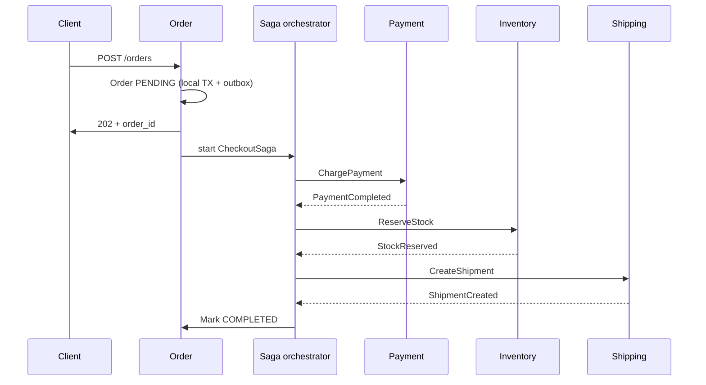
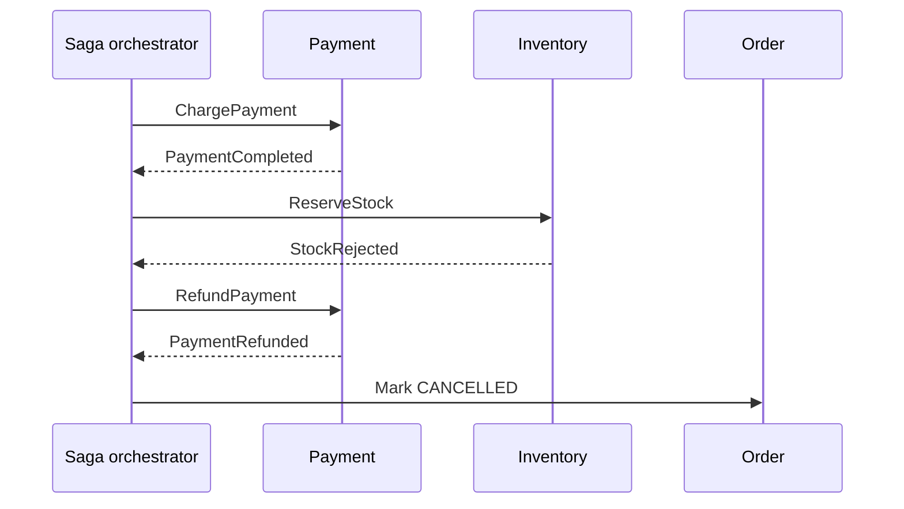

# Saga Pattern in Microservices — Detailed Study

Starting reference: [Saga pattern walkthrough](https://youtu.be/d2z78guUR4g?si=5cB7dk3dSYn99ou_)

This note is a mid-to-senior study of the **saga pattern** as it is actually used to coordinate business processes across microservices: why distributed ACID is usually rejected, what compensation really means, how choreography differs from orchestration, and where sagas fail in production.

Related local notes: `Event-Driven_Architecture.md` (outbox, inbox, dual-write, events vs commands), `DISTRIBUTED_system.md` (CAP/PACELC, sync vs async).

---

## 1. Why 2PC does not survive Database per Service

A monolith can wrap “create order, charge card, decrement stock, create shipment” in **one database transaction**. Commit or rollback is a single ACID decision.

Microservices typically apply **Database per Service**. Each service owns its schema and its locks. There is no shared transaction manager that can atomically commit Postgres in Orders, a payments ledger, and an inventory store.

The remaining options:

| Approach | What it gives you | Why teams reject it as the default |
| --- | --- | --- |
| **Two-phase commit (2PC / XA)** | Strong consistency across resources | Coordinator is a blocking SPOF; participants hold locks during the uncertain window; poor fit across heterogeneous DBs, brokers, and cloud APIs; latency of two rounds |
| **Synchronous RPC chain in one request** | Immediate “yes/no” to the client | Cascading latency, cascading failure, no honest rollback if service 3 fails after service 2 already committed |
| **Saga + eventual consistency** | Each service keeps local ACID; the *process* converges | Intermediate states are visible; compensation is a new business action, not a DB undo |

**Why 2PC specifically fails the microservice test:**

1. **Locks across the network.** After PREPARE, a participant cannot abort locally until the coordinator decides. If the coordinator dies, those locks sit until timeout or manual recovery.
2. **Availability.** Every participant must be reachable for both phases. One slow payment provider stalls the whole checkout.
3. **Heterogeneity.** XA across Postgres + Mongo + Stripe + Kafka is not a thing you want. Many SaaS APIs have no prepare phase at all.
4. **CAP.** 2PC chooses consistency over availability. Microservices are usually designed to keep taking orders when one downstream is degraded.

Interview-safe sentence: *2PC is a distributed lock protocol, not a product strategy. Database per Service made a single ACID transaction impossible, so we coordinate a sequence of local transactions and undo with compensation.*

---

## 2. What a saga is

Chris Richardson (and the Garcia-Molina / Salem 1987 paper before him): a saga is a **sequence of local transactions**. Each step:

1. Updates **one** service’s database (local ACID).
2. Publishes a message / emits a command that triggers the next step (or a compensation).

If a later step fails a **business rule** (card declined, stock gone, address invalid), the saga does **not** roll back a global transaction. It runs **compensating transactions** for the steps that already committed.

```
T1 → T2 → T3 → T4          happy path (local commits)
T1 → T2 → T3 ✗             T3 fails
     C2 → C1               compensate in reverse (usually)
```

`Tn` is a forward local transaction. `Cn` is the compensating transaction for `Tn`.

A saga is **not**:

- A distributed transaction.
- Event sourcing (persistence choice).
- “We put Kafka in the middle” (that is messaging). Kafka is a transport; the saga is the **workflow + compensation policy**.

A saga **is** a consistency strategy for a business process that spans services: **forward progress or semantic undo**, with **eventual** (not isolation-preserving) consistency.

---

## 3. Compensation is not rollback

Rollback restores the previous row. Compensation is a **new business action** that *semantically* reverses the effect.

| Forward step | Naive “undo” people imagine | What compensation actually is |
| --- | --- | --- |
| Reserve inventory | Delete the reservation row | `ReleaseHold` / restock — may race with other orders |
| Charge card | Un-insert the charge | `Refund` — fees, FX, settlement timing; money may already have moved |
| Send “order placed” email | Un-send | Send “order cancelled” — the original email already happened |
| Dispatch courier | Un-ship | Return / intercept — warehouse and carrier have their own processes |

Consequences:

- **Put irreversible steps last** (or outside the saga). Email, courier, regulatory filings.
- Compensations **fail**. They need retries, idempotency, DLQ, and human escalation. “Compensation” is not a guaranteed inverse function.
- Some states cannot be restored. After a refund, the customer’s available credit, the card statement, and your ledger are not the world as of `T1`.
- Design the **business language** of cancel: `OrderCancelled`, `PaymentRefunded`, `InventoryReleased` — not `ROLLBACK`.

If a step has no honest compensation, it does not belong in the middle of a saga. Isolate it, make it the last step, or do not split that invariant across services.

---

## 4. Two coordination styles

The saga steps are the same. The difference is **who knows the next step**.

### 4.1 Choreography (events drive the next step)

Each service listens to events, does its local work, and publishes what happened. There is **no central coordinator**. Coupling is to **event contracts**, not to a workflow service.

```
Order Service
  --OrderCreated-->  Payment Service
                       --PaymentCompleted-->  Inventory Service
                                                --StockReserved-->  Shipping Service
                                                                     --Shipped-->  Order Service (status = COMPLETED)

On PaymentFailed:
  Payment --PaymentFailed--> Order (CANCELLED)
  (Inventory never reserved; nothing to compensate)

On StockReserved fail after payment succeeded:
  Inventory --StockRejected--> Payment (refund) and Order (CANCELLED)
```

**Gains:** no extra orchestrator to run; services stay independently deployable; easy fan-out (analytics, email, search can subscribe without being in the checkout path).

**Costs:** the workflow lives in **no one program**. Adding a step means changing who emits/consumes what. Cyclic event dependencies (`OrderUpdated` ↔ `PaymentUpdated`) appear. Debugging is a distributed trace plus an event catalog. Compensation logic is **scattered**.

**Fits:** 2–3 services, mostly linear, side effects that are independent (index, notify). Bad fit for money + stock + branching SLAs.

### 4.2 Orchestration (a coordinator drives commands)

A saga orchestrator (dedicated service, or the Order service plus a state machine, or Temporal / Camunda / Step Functions) **tells** participants what to do, records replies, and decides the next command or compensation.

```
Client → Order Service → Saga orchestrator
           │
           ├─ command: ChargePayment      ← reply OK / FAIL
           ├─ command: ReserveInventory   ← reply OK / FAIL
           ├─ command: CreateShipment     ← reply OK / FAIL
           └─ on any FAIL: compensate completed steps, mark Order CANCELLED
```

The orchestrator owns the **state machine**: `PENDING → PAYMENT_OK → STOCK_OK → SHIPPED` or `COMPENSATING → CANCELLED`.

**Gains:** workflow is explicit; timeouts, retries, and compensation policy live in one place; “where is order 42?” is a query against saga state; easier audit and human gates.

**Costs:** orchestrator knows participant APIs (coupling concentrated, not gone); naive implementations become a god service and a SPOF — **durable execution** (persist workflow progress) is the production answer, not an in-memory loop.

**Fits:** 4+ steps, branching, money, SLAs, “must compensate in this order,” operators who need a UI of in-flight sagas.

### 4.3 When to use which

| | Choreography | Orchestration |
| --- | --- | --- |
| Coupling | Event contracts; services must know *what happens next* | Orchestrator knows the graph and command APIs |
| Visibility | Implicit; hard to draw without an event catalog | Explicit state machine / workflow code |
| Failure handling | Compensation scattered; easy to miss a C-step | Central policy, timers, retries |
| Adding a step | New consumer (or change publishers) | Change coordinator |
| Testing | Need a broker and several services | Can unit-test the state machine; still need contract tests |
| Best fit | Simple linear fan-out, 2–3 services, independent side effects | Core checkout, 4+ steps, branching, audit |
| Typical tools | Kafka / RabbitMQ / SNS | Temporal, Camunda, Step Functions, custom orchestrator + outbox |

**Default for 2026 interviews:** choreograph **secondary** reactions (`OrderConfirmed` → email, loyalty, analytics). **Orchestrate** the core money/inventory path. Hybrid is normal, not a cop-out.

A client that starts a saga via `POST /orders` still needs an outcome channel: return `202` + `order_id`, then poll `GET /orders/{id}`, websocket, or webhook when the saga hits a terminal state. Do not hold the HTTP request for warehouse confirmation.

---

## 5. Worked example: Order → Payment → Inventory → Shipping

**Goal:** accept an order only if payment succeeds, stock is reserved, and a shipment is created. If anything after a successful payment fails, refund and release stock. If shipping cannot be created, reverse stock and payment.

**Recommended shape:** orchestrate the four steps; choreograph notifications off terminal events.

### 5.1 Happy path



Each arrow to Payment / Inventory / Shipping is a **local transaction in that service**, then a reply (or a domain event the orchestrator consumes). Publish those replies via **outbox**; consume with **inbox** so retries do not double-charge.

### 5.2 Failure: inventory rejects after payment succeeded



Shipping never ran — nothing to compensate there.

### 5.3 Failure: shipping fails after payment and stock succeeded

Compensate **in reverse order of success** (usual default): cancel shipment attempt if any, release stock, refund payment, mark order cancelled.

```
COMPLETED:  T_payment, T_inventory
FAILED:     T_shipping
COMPENSATE: C_inventory (ReleaseStock), C_payment (Refund)
TERMINAL:   Order = CANCELLED
```

If `C_payment` fails (Stripe timeout), the saga is **stuck in COMPENSATING**. That is a first-class state: retry with backoff, DLQ, pager. Do not pretend the order is cancelled while money is still captured.

### 5.4 What the Order row looks like (no isolation)

While the saga is in flight, other readers can see `PENDING`, payment captured, stock reserved, shipment missing. That is not a bug in the saga; it is **missing isolation**. Concurrent sagas can also fight over the last unit of stock. Design for it: `PENDING` / `PAYMENT_HELD` statuses, reservation TTLs, and do not expose “in-progress checkout” as a confirmed order in the UI.

---

## 6. Saga vs 2PC vs ACID vs eventual consistency

| | Local ACID (one service) | 2PC / XA | Saga |
| --- | --- | --- | --- |
| Atomicity | Yes, one DB | Yes, all or nothing across resources | **Process** atomicity via compensate — not row-level undo |
| Consistency (invariants) | Enforced in one DB | Enforced at commit of all participants | Enforced **eventually**; intermediate states violate global invariants |
| Isolation | Yes (within the TX) | Yes (locks until global commit) | **No.** Other sagas see in-flight work |
| Durability | Yes | Yes if 2PC completes | Each local commit is durable; saga *progress* must also be durable |
| Availability | Service + its DB | All participants + coordinator | Degraded participants can fail a step; rest of the estate stays up |
| Typical latency | One commit | Two phases + lock time | Sum of steps (async); client often polls |

**ACID of a saga:** you get **local A, C, D**. You do **not** get **I** across services. Saying “sagas are eventually consistent ACID” is sloppy. Say: *each step is ACID; the business process is eventually consistent and isolation-free.*

**Eventual consistency** here means: if the saga completes (success or full compensation), the system converges on a terminal state (`COMPLETED` or `CANCELLED`). It does **not** mean “we hope Payment and Inventory agree.” Hope is not a strategy — timeouts, retries, and observed saga state are.

**TCC (Try / Confirm / Cancel)** is a cousin: Try places a hold, Confirm converts it, Cancel releases it. Stronger than a blind charge-then-refund saga for seats and funds. Still not XA. Mention it when the interviewer wants a reservation protocol.

---

## 7. Common pitfalls (this is where interviews go)

**Idempotency.** Brokers and orchestrators retry. `ChargePayment` twice is two charges unless the payment service keys on `saga_id + step` (inbox / idempotency key). Compensation must be idempotent too: two refunds is worse than two charges.

**Partial failure / crash between local commit and “tell the orchestrator.”** Dual-write. If Payment commits the capture and dies before publishing `PaymentCompleted`, the saga stalls. **Transactional outbox** on every saga participant. Orchestrator state itself must be durable (DB row or Temporal history), or a crash loses “we already charged.”

**Compensation cannot restore original state.** Refund ≠ never charged. Stock released may be taken by another order. Design business meaning of cancel, not bitwise undo. Customer-visible copy: “cancelled and refunded,” not “as if it never happened.”

**Ordering.** Choreography: Kafka orders **per partition**. Key by `order_id`. Cross-service event order is not a global clock. Orchestration: the coordinator sequences commands; still tolerate duplicate replies. Out-of-order `StockReserved` after `OrderCancelled` must be a no-op or a compensating release.

**Timeouts.** A participant that never replies is not “maybe success.” Define: retry, then compensate, then human. Payment captured + orchestrator timeout without a reply is the dangerous case — **query** the payment service (or Stripe) before refunding; do not refund blindly on timeout.

**Lost isolation / dirty intermediate reads.** Another request sees reserved stock that will be released. Countermeasures from Richardson: semantic lock (status = `CREDIT_RESERVED`), commutative updates, pessimistic view (“pending”), reread value, versioning. These are part of saga design, not polish.

**God orchestrator / event spaghetti.** Orchestration: keep the coordinator a **workflow**, not a dumping ground for all business rules. Choreography: cap hop count; if nobody can draw the graph, you already lost.

**Compensating the compensator.** `Refund` fails after `ReleaseStock` succeeded. You now have stock free and money captured. Saga state must allow **partial compensation** and replay of the failed C-step. Never assume C-steps are atomic as a group.

**Starting the saga twice.** Client retries `POST /orders`. Idempotency key on the create-order API, or you run two checkouts.

---

## 8. When NOT to use a saga

- The invariant **fits in one service** (one DB transaction). Do not split “debit A, credit B” across services if they can share a ledger.
- Compensation is **impossible or legally meaningless** (some regulatory postings, some physical processes already completed). Isolate or use a human workflow.
- The client **must** have a strongly isolated, immediately correct result and you can keep that work in one transaction (or a rare, tightly scoped 2PC inside one data center).
- The team cannot operate **durable workflow + outbox + idempotent consumers**. A half-implemented saga is silent money bugs.
- You only needed **fan-out** (email, search index). That is events, not a saga — no compensation graph.
- You are about to 2PC-through-Kafka by another name (sync RPC chain with ad-hoc reverse calls and no saga state).

If you need a hold-then-confirm semantic and can implement Try/Confirm/Cancel, prefer **TCC** over charge-then-hope-to-refund for scarce inventory and funds.

---

## 9. Production stack that actually makes sagas work

Sagas are not an alternative to outbox/inbox. They **sit on top**:

```
Database per Service
  └── each saga step = local TX
        ├── Outbox  → reliable command/event out
        ├── Inbox   → exactly-once *effect* on consume
        └── Orchestrator / choreography graph
              └── durable saga state, timers, compensation
```

- **Durable execution** (Temporal-style): crash does not forget that payment already captured.
- **Correlation:** `saga_id` / `order_id` on every message; OpenTelemetry `traceparent`; logs with both.
- **Observability:** workflow instance UI; metrics on in-flight sagas, compensation rate, step latency, stuck `COMPENSATING`; DLQ depth.
- **Client UX:** `202` + poll or push; never tell the user “paid and shipped” before the saga is terminal.

---

## 10. Interview questions (5–6 year bar)

### Q1: What is a saga, in one paragraph, without saying “loosely coupled”?

**Answer:** A business process split into local transactions in different services. Each step commits in its own database and triggers the next. If a later step fails, we run compensating transactions for the steps that already committed. The process is eventually consistent; we never had a global lock.

### Q2: Why not 2PC for checkout across Order, Payment, and Inventory?

**Answer:** 2PC holds locks in the uncertain window, needs every participant and the coordinator up, and does not exist cleanly across Stripe + Postgres + another team’s Mongo. Availability and operational cost lose to a saga: local commits plus refund/release if a later step fails.

### Q3: Is a compensating transaction a rollback?

**Answer:** No. It is a new action (refund, release hold, cancellation email). The original email/charge/shipment may already have hit the outside world. Compensations fail and must be idempotent. Irreversible steps go last.

### Q4: Choreography vs orchestration for Order → Payment → Inventory → Shipping?

**Answer:** Orchestrate the core (payment, stock, shipping, compensation, timeouts) so one state machine owns “where is this order?” Choreograph email/analytics off `OrderCompleted` / `OrderCancelled`. Pure choreography for this path hides an implicit state machine in four codebases.

### Q5: What ACID properties does a saga *not* give you?

**Answer:** Isolation (and global atomicity). Intermediate states are visible. Concurrent sagas can oversell stock unless you add reservations, semantic locks, or TCC-style holds. Durability of *saga progress* is a separate problem — persist orchestrator state.

### Q6: Payment succeeded, then the orchestrator crashed before inventory. What happens?

**Answer:** If saga state and the payment event were not durable, you may charge and forget. Production: outbox on Payment, durable workflow (or saga row committed with the start). On resume, see “payment completed,” continue or time out and compensate. Never restart from `ChargePayment` without an idempotency key.

### Q7: Timeout on `ChargePayment` — refund or retry?

**Answer:** Unknown. Query payment provider / local payment row first. Retry with the same idempotency key if no capture; refund only if captured. Blind refund on timeout can refund a charge that never happened or miss a charge that did.

### Q8: When would you *not* introduce a saga?

**Answer:** When one service can own the invariant; when compensation is a lie; when you only needed pub/sub fan-out; when the team cannot run durable workflows and idempotent consumers. Prefer a modular monolith for that slice over a distributed money bug.

### Q9: How do you make `POST /orders` feel synchronous?

**Answer:** Persist `Order(PENDING)` locally, return `202` + id (or wait a short time for a fast-path success). Client polls or subscribes to terminal state. Do not block the request on shipping.

### Q10: Saga vs TCC vs 2PC — one line each.

**Answer:** 2PC: atomic commit, locks, low availability. Saga: local commits + semantic compensate, no isolation. TCC: try-hold, then confirm or cancel — a reservation protocol still without XA.

### Q11: How do you test a saga?

**Answer:** Unit-test the state machine (every fail/compensate path). Contract tests on commands/events. Integration with Testcontainers for broker + DBs. Chaos: duplicate delivery, crash after local commit, out-of-order events, compensation failure, timeouts. Assert terminal Order/Payment/Inventory invariants, not only “happy HTTP 200.”

### Q12: Why key messages by `order_id`?

**Answer:** So one aggregate’s events stay ordered on one partition and the orchestrator is not racing two sequences for the same order. Cross-order concurrency is expected; cross-step reorder for the *same* order is how you double-ship or skip compensation.

---

## 11. Further reading

- Garcia-Molina & Salem (1987) — original Sagas paper (long-lived transactions + compensation)
- Chris Richardson — [Pattern: Saga](https://microservices.io/patterns/data/saga.html)
- Chris Richardson — [Pattern: Database per service](https://microservices.io/patterns/data/database-per-service.html)
- Microsoft Learn — [Saga distributed transactions](https://learn.microsoft.com/en-us/azure/architecture/patterns/saga)
- Related: `Event-Driven_Architecture.md` §9 (saga in the EDA stack), §5–7 (outbox / inbox / dual-write)
