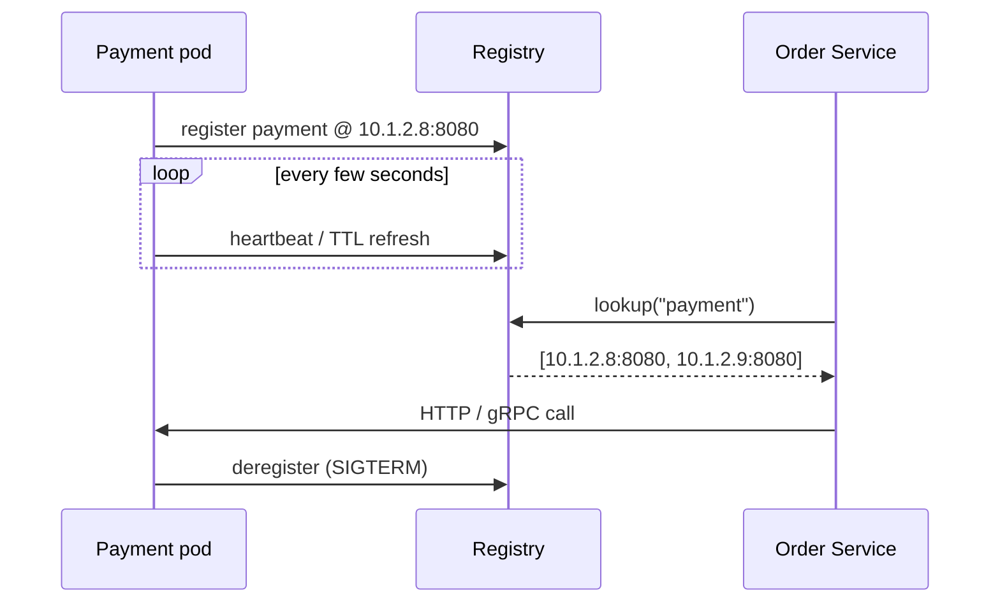
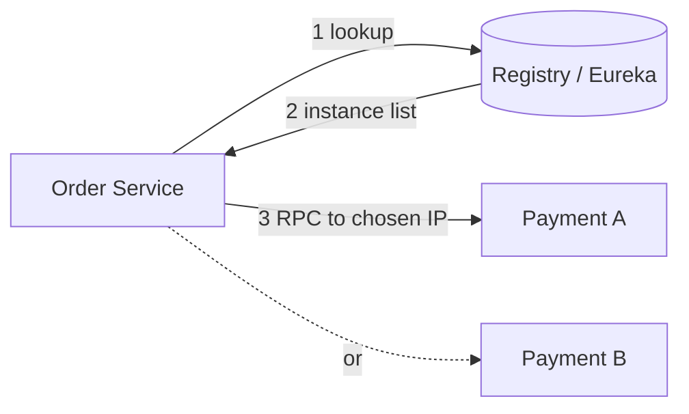
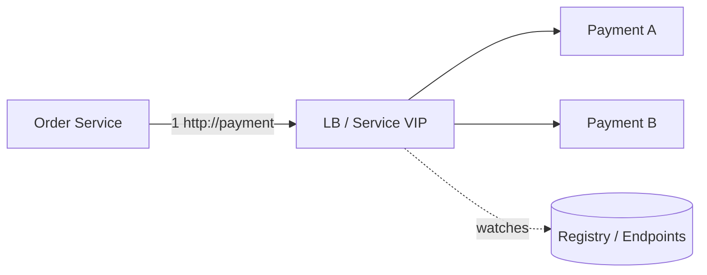
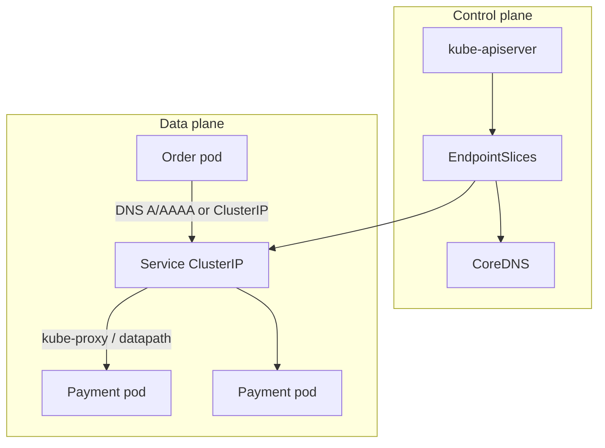

# Service Discovery Pattern in Microservices — Detailed Study

Starting reference: [Service Discovery walkthrough](https://youtu.be/ecuEkmFs5Vk?si=cpY5aovxGfo0l9Og)

This note is a mid-to-senior study of the **Service Discovery** pattern: how services find each other when instances appear, move, and die; why hardcoded URLs fail in containers; how a registry, heartbeats, and load balancing actually work; and when you should **not** build your own (prefer Kubernetes Services / a mesh).

Related local notes: `FINAL/MICROSERVICES/DISTRIBUTED_system.md` (fallacy: “topology doesn’t change”; client- vs server-side LB), `FINAL/MICROSERVICES/Circuit_Breaker_Pattern.md` (what you do *after* you found an instance that is sick), `FINAL/MICROSERVICES/Database_per_service.md` (you discover *services*, not other teams’ databases).

---

## 1. What problem it solves

In a monolith, `PaymentService` is a class. The call is in-process. The address never changes at runtime.

In microservices, Order needs to call Payment. Payment is **N processes** (pods, VMs, containers) whose **IPs and ports change constantly**:

- Autoscaling adds and removes replicas.
- Deployments replace pods; the old IP is gone.
- Nodes die; the orchestrator reschedules elsewhere.
- Containers get a **new IP on every restart** (Kubernetes default).
- Multiple versions can run at once (canary, blue-green).

**Service discovery** is the mechanism that answers: *given a logical name (`payment-service`), which healthy instances exist right now, and how do I send this request to one of them?*

It is **not** DNS-as-an-afterthought. It is a **control plane** (who is alive, where) plus a **data plane** (how traffic actually reaches them). Interviews fail people who say “we just use DNS” without talking about TTL, health, and stale endpoints.

Interview-safe sentence: *Service discovery maps a stable service name to a changing set of instance addresses, and it must drop instances that are dead or not ready.*

---

## 2. Why hardcoded URLs / IPs fail

```
Order Service  →  http://10.0.12.44:8080/pay     # last week’s pod
```

| Environment | What breaks |
| --- | --- |
| **VMs with static IPs** | Still fails on failover, scale-out, and port reuse. You end up editing config and restarting callers. |
| **Containers** | IP is allocated from a pool. Restart = new IP. Hardcoding is a production bug, not a shortcut. |
| **Kubernetes** | Pods are cattle. `podIP` is not a contract. Even a Deployment’s replica set is not a stable address. |
| **Multi-AZ / multi-region** | The “right” instance depends on locality and health, not a config file from last Tuesday. |
| **Canary / rolling deploy** | Two versions coexist. A static list cannot express “10% to v2, skip unready pods.” |

Config files, env vars, and “the URL in `application.yml`” are fine for **external** SaaS (`api.stripe.com`) or a **stable platform name** (`payment.svc.cluster.local`). They are not fine as a list of **peer instance IPs**.

The old SOA answer was a **load balancer with a static backend pool**, updated by humans or a ticket. Microservices (and especially Kubernetes) made the pool **too dynamic** for that ops loop. Discovery automates membership.

---

## 3. The service registry

A **registry** is a directory: `service name → [ {host, port, metadata, health}, … ]`.

Lifecycle:

```
instance starts
    → register (name, IP, port, version, zone, weight, …)
    → heartbeat / health TTL while alive
    → deregister on graceful shutdown
    → if crash: TTL expires or health check fails → evicted
```



**What must be true:**

1. **Register on startup** — after the process can actually serve (or the platform marks it Ready). Registering before listen() dumps traffic onto a closed port.
2. **Deregister on shutdown** — Kubernetes `preStop` / SIGTERM should remove the endpoint **before** the process stops accepting. Otherwise callers get connection-refused during every deploy.
3. **Heartbeats or active health checks** — crash does not run `finally`. Without TTL, the registry serves **zombie IPs**.
4. **Metadata** — version, zone, canary group, gRPC vs HTTP, weight. Load balancing and routing use this, not just host:port.

The registry is **data**, not magic. Consul, Eureka, etcd, ZooKeeper, and Kubernetes `Endpoints` / `EndpointSlices` are all registries with different consistency and APIs.

---

## 4. Two ways to *use* the registry

Chris Richardson’s split, still the interview frame:

### 4.1 Client-side discovery

The **caller** queries the registry, picks an instance (load-balances **itself**), and calls it directly.

```
Order  →  Registry: "who is payment?"
Order  →  10.1.2.8:8080   (chosen locally)
```

Classic stack: **Netflix Eureka** (registry) + **Ribbon** (client LB) + Spring Cloud. gRPC **lookaside** load balancing is the same idea (resolver + picker in the client).



**Gains:** no extra hop; client can do **zone-aware**, weighted, or hedged picks; LB policy lives with the caller (latency, retries).

**Costs:** every language/framework needs a discovery client; upgrading LB logic means **redeploying all callers**; clients can cache a stale list; the registry is on the hot path of *every* service (or you cache hard and accept staleness).

**Fits:** pre-Kubernetes Netflix-style VMs; polyglot shops that already standardized on one client library; gRPC with custom pickers. Less common as the *primary* model on Kubernetes in 2026.

### 4.2 Server-side discovery

The caller uses a **stable name** (DNS, VIP, load-balancer URL). **Infrastructure** resolves that name to instances.

```
Order  →  http://payment-service   (or an ELB DNS name)
         ↓
   Load balancer / kube-proxy / mesh sidecar
         ↓
   Payment A or B
```

Classic stack: **AWS ELB/ALB/NLB**, NGINX, HAProxy, **Kubernetes Service + kube-proxy / CoreDNS**.



**Gains:** clients stay dumb (`CLUSTER-IP` or DNS); one place to change LB; languages do not each implement Eureka; the platform already health-checks.

**Costs:** extra hop (unless sidecar/eBPF is local); LB is a failure domain; least-request / outlier detection depends on **what the LB can see** (L4 vs L7); DNS caching in the caller can still go stale.

**Fits:** Kubernetes, cloud load balancers, almost every “we did not invent Netflix OSS” shop. **Default answer in 2026.**

---

## 5. Kubernetes specifically (this is what interviewers expect)

Kubernetes **is** service discovery if you use it honestly. Do not bolt Eureka onto a cluster unless you have a real reason (legacy Spring Cloud, multi-cluster federation outside k8s DNS).

### 5.1 Service, Endpoints, DNS

A **Service** (`payment`) gives you:

- A **stable virtual IP** (ClusterIP) and/or a **DNS name**: `payment.default.svc.cluster.local`
- A **selector** that matches Pod labels
- An **Endpoints** / **EndpointSlice** object listing ready pod IPs + ports



**Flow for `http://payment:8080`:**

1. Order’s resolver asks **CoreDNS** → ClusterIP (or, with `spec.clusterIP: None`, the **pod IPs** directly — headless).
2. Packet to ClusterIP is rewritten by **kube-proxy** (iptables/IPVS) or replaced by **eBPF** (Cilium) to a backend pod.
3. Only **Ready** pods are in the EndpointSlice (see probes below).

The Service name is the **logical service**. Pod IPs are the **instances**. That *is* server-side discovery.

### 5.2 kube-proxy vs service mesh

| Layer | What it does | What it does not do |
| --- | --- | --- |
| **kube-proxy / ClusterIP** | L4 (usually) distribution to ready endpoints | App-level retries, mTLS, outlier ejection, per-request routing |
| **CoreDNS** | Name → ClusterIP or pod IPs | Health beyond “is this name in the slice?” |
| **Ingress / Gateway API / cloud LB** | North-south entry | Not a substitute for in-cluster east-west discovery |
| **Service mesh sidecar** | L7: discover via xDS, LB, retries, timeouts, mTLS | Business fallbacks (that stays in the app — `Circuit_Breaker_Pattern.md`) |

**Headless Service** (`clusterIP: None`): DNS returns **pod IPs**. The client (or a stateful set member) must pick. Used for StatefulSets, Kafka brokers, gRPC client-side LB. You just opted into **client-side discovery on top of k8s DNS**.

**ExternalName / Multi-cluster:** Service can alias an external DNS name. Discovery of *off-cluster* deps is still “stable name,” not Eureka.

### 5.3 Probes: live vs ready vs startup (discovery cares about Ready)

| Probe | Question | If it fails |
| --- | --- | --- |
| **liveness** | Should this process be killed? | Restart. Does **not** by itself mean “leave the Service.” A live-but-unready pod can still be excluded via readiness. |
| **readiness** | Should this pod receive traffic? | Removed from Endpoints. **This is discovery health.** |
| **startup** | Is the slow boot done? | Disables the other probes until it passes; prevents kill-during-boot. |

Misconfig: liveness hitting a downstream DB → restart storm. Readiness that is always true → traffic to a pod that cannot talk to Redis yet. Discovery will happily send Order to a Payment that will 500.

---

## 6. Service mesh as the evolution

**Istio / Linkerd / Consul Connect:** a sidecar (or ambient/eBPF dataplane) sits next to every pod. The sidecar, not the app, does discovery, load balancing, retries, timeouts, and **mTLS**.

```
Order app  →  localhost sidecar  →  (mTLS)  →  Payment sidecar  →  Payment app
                   ↑
            control plane (xDS): cluster members, weights, outlier detection
```

The app still dials `payment:8080` (or a mesh-local name). The **platform** watches EndpointSlices (or Consul) and pushes **endpoints to the sidecar**. That is server-side discovery with a **smarter** LB than kube-proxy.

Why meshes showed up after Eureka:

- **Language-agnostic** — no Ribbon in every repo.
- **Identity** — SPIFFE/mTLS so discovery is not “anyone who knows the IP.”
- **Outlier detection** — eject a single bad pod without removing the whole Service (related to circuit breaking at *instance* granularity).
- **Traffic shifting** — 5% canary by header, not by rewriting client code.

Cost: extra hop (mitigated by ambient mesh / eBPF), control-plane load, debugging “the sidecar ate my request.”

Interview line: *A mesh does not replace the registry; it consumes it. Kubernetes Endpoints remain the source of membership; Envoy is the client that nobody had to write.*

---

## 7. Registration styles, heartbeats, TTL

### 7.1 Self-registration vs third-party registration

| Style | Who registers | Typical |
| --- | --- | --- |
| **Self-registration** | The service process calls `registry.register()` on boot | Eureka clients, old Consul agent embed, many Spring Cloud apps |
| **Third-party / platform** | A sidecar, kubelet, or registrar watches the instance and updates the registry | **Kubernetes** (kubelet + endpoint controller), Consul agent on the node, Nomad, service mesh |

**Prefer third-party on Kubernetes.** The app should not need Consul libraries just to exist. The kubelet already knows pod IP and Ready. Self-registration duplicates what the platform knows and races with probes (app says “up,” kubelet says “not Ready”).

Self-registration still appears in **VMs**, **ECS without Service Discovery**, and **legacy Spring Cloud**. If you use it: register **after** bind + warmup; deregister in a shutdown hook **and** rely on TTL for crashes.

### 7.2 Heartbeats vs active health checks

| Mechanism | Idea | Failure mode |
| --- | --- | --- |
| **Heartbeat / TTL** | Instance renews a lease; expiry → evict | Network blip evicts a healthy node; too-long TTL leaves zombies |
| **Active health check** | Registry or LB probes `/health` or TCP | Check path not equal to serving path (false healthy); check storms |
| **Passive / outlier** | LB notices 5xx/timeouts and ejects | Needs enough traffic; can eject the whole cluster if the *caller* is misconfigured |

Production systems **combine**: Kubernetes Ready (active, kubelet) + mesh outlier (passive) + app breaker (dependency sick, not instance unknown).

**TTL tuning:** shorter TTL = faster death detection, more registry chatter, more false evictions. Longer TTL = stale IPs after a crash (the classic “we scaled in and 2% of requests still hit the dead node for 30s”).

---

## 8. Load balancing, caching, and consistency of the list

Discovery without LB is a phone book. You still must **pick**.

| Policy | Where it usually lives |
| --- | --- |
| Round-robin / random | kube-proxy, Ribbon, Envoy |
| Least-request | Envoy, some L7 LBs — needs connection awareness |
| Zone-aware / locality | Mesh, cloud LB, custom Ribbon rules |
| Weighted / canary | Service mesh, Ingress, Gateway API |

**Caching of lookups:** clients (and even JVM DNS caches) **must** cache or you DDoS the registry. Cache + watch (push) is better than poll. Eureka: client fetch + delta. Kubernetes: watch EndpointSlices. Consul: blocking queries.

**Stale entries** are the real bug:

- DNS **TTL** in the app or `nscd` / Java `networkaddress.cache.ttl` (default can be **forever** on successful lookups in old JDKs). ClusterIP is stable; **headless** pod IPs are not — a 30s TTL after a scale-in is a 30s error budget burn.
- Client-side Eureka cache: instance died, TTL not expired, Ribbon still sends.
- Endpoint controller lag: pod Ready=false but slice not updated yet → 502 during rollouts. **Graceful shutdown** (`preStop` sleep, `terminationGracePeriodSeconds`, deregister first) is how you make deploys boring.

**Split-brain of the registry:** if you run a **clustered** registry (Consul/etcd/ZK) and it partitions, two sides may disagree on membership. Traffic might blackhole or **split** (some clients see different sets). Mitigation: **quorum** (Consul/etcd), treat the registry as a **CP** system for membership, and do not run “two Eurekas that do not replicate” in two DCs pretending they are one pool. Kubernetes: apiserver + etcd is the registry; you do not invent a second one.

**Thundering herd:** 500 pods start, all register, all clients refetch. Watches and jittered heartbeats exist so the registry does not melt at deploy time. A custom “poll every 1s from 2,000 clients” design will fail an interview *and* a Friday deploy.

---

## 9. Comparison: client-side vs server-side vs mesh

| | **Client-side** (Eureka + Ribbon) | **Server-side** (ELB, k8s Service) | **Service mesh** (Istio / Linkerd) |
| --- | --- | --- | --- |
| Who picks the instance | The calling app | LB / kube-proxy / datapath | Sidecar / ztunnel next to the app |
| Client complexity | High (library per language) | Low (dial a name) | Low in app; high in platform |
| Extra hop | No | Yes (LB); ClusterIP is a virtual hop | Sidecar hop (or ambient) |
| Health | Heartbeat + client cache | Readiness + LB checks | Endpoints + outlier + mTLS identity |
| Canary / L7 routing | Custom client rules | Ingress / Gateway / some LBs | First-class |
| Blast radius of LB bug | Every client version | Central LB | Mesh control plane + sidecars |
| Best default | Legacy VM / Spring Cloud | **Kubernetes east-west** | When you need mTLS, retries, traffic split without app code |
| Typical tools | Eureka, Consul client, gRPC lookaside | CoreDNS, kube-proxy, ALB/NLB, Cilium | Istio, Linkerd, Consul Connect |

**2026 default:** Kubernetes Service + DNS + readiness. Add mesh when security and L7 traffic policy are requirements, not because “microservices need Istio.” Keep Eureka only for **non-k8s** or a strangler of a Spring Cloud estate (`Strangler_pattern.md`).

---

## 10. Trade-offs and pitfalls

| Pitfall | What it looks like | What to do |
| --- | --- | --- |
| **Registry as SPOF** | Eureka down → nobody can start or (worse) nobody can refresh; clients use last cache until it is wrong | HA registry (3+ nodes, quorum). Kubernetes: etcd/apiserver SLOs. Clients: **cached last-known** with expiry, not fail-closed on every lookup if policy allows |
| **Thundering herd** | Deploy → registry CPU 100% → false TTL expiry → more churn | Watches not polls; jitter heartbeats; bulk EndpointSlices |
| **Stale IP after crash** | SIGKILL, OOM, node death — no deregister | Short TTL / readiness; mesh outlier; never trust only graceful hooks |
| **DNS TTL** | Headless service, Java infinite cache, glibc cache | ClusterIP for dumb clients; tune JVM DNS TTL; use watches/gRPC resolvers for headless |
| **Health ≠ Ready ≠ Live** | `/health` pings the DB and fails the whole cluster; or Ready is always true | Liveness = process; Readiness = “can serve *this* traffic”; dependency checks in readiness **carefully** (optional deps should not remove the pod from *all* traffic) |
| **Self-registration race** | App registers before listen, or before migrations | Platform registration on Ready; or register at the end of startup |
| **Client-side library sprawl** | Python has no Ribbon; Node has a different cache bug | Server-side or mesh |
| **Eureka-on-Kubernetes** | Two sources of truth (Endpoints vs Eureka) | Pick **one**. Usually k8s |
| **Discovering databases** | Order “discovers” Inventory’s Postgres | Never. Database per Service: you discover **Inventory’s API**, not its DB (`Database_per_service.md`) |
| **Split-brain membership** | Two registry partitions, two “truths” | Quorum CP registry; do not dual-master Eureka across DCs |
| **No graceful drain** | Every deploy = 5xx spike | `preStop`, remove from LB, wait, then exit |
| **Using discovery for config** | Registry stuffed with feature flags | Separate config (K8s ConfigMap, Consul KV with care). Registry is **membership** |

Discovery finds **where**. Circuit breakers, retries, and timeouts decide **whether to keep calling**. Do not conflate “instance missing from registry” with “Payment is slow” — the latter is `Circuit_Breaker_Pattern.md`.

---

## 11. When to use it / when NOT to build a custom one

**You always need discovery** once you have more than one mutable instance. The question is **whose**.

**Use platform discovery when:**

- You are on **Kubernetes** (Service + DNS + EndpointSlices + probes).
- You are on **cloud** (ALB/NLB target groups, Cloud Map, ECS Service Discovery).
- You need mTLS and L7 policy → **mesh** on top of k8s Services, not a homemade Eureka.

**Use client-side (Eureka/Consul client) when:**

- Workloads are **VMs / bare metal** without a cluster VIP.
- You are maintaining a **Spring Cloud** estate that is not on k8s yet.
- gRPC **client-side LB** with a lookaside resolver (xDS, Headless + picker).

**Do not roll a custom registry when:**

- Kubernetes already has one (etcd + Endpoints). A second registry is a split-brain factory.
- The “microservices” are three processes on one docker-compose with Compose DNS — that **is** discovery; stop.
- You wanted Consul because a blog post from 2016 said so, and you already run k8s.
- You are about to store **instance IPs in a database table** and poll it. That is a worse Eureka.
- Monolith, one instance, static VM — DNS or a config URL is enough. Pattern overhead is not free.

**When NOT to use “service discovery” as the answer at all:**

- **Async / events:** Order does not discover Inventory to place a message; it discovers the **broker** (which *does* use discovery internally). Do not invent RPC discovery for a path that should be a topic (`Event-Driven_Architecture.md`).
- **External SaaS:** Stripe’s DNS is their problem; you use a stable URL + breaker.
- **Users / browsers:** they hit an API gateway / Ingress, not Eureka.

---

## 12. Mental model for interviews (one paragraph)

*Instances in microservices do not have stable IPs. Service discovery maps a logical name to the current healthy set. A registry holds membership: register on start, heartbeat or health-check while alive, deregister or TTL-evict on death. Client-side discovery (Eureka + Ribbon) means the caller looks up and load-balances. Server-side (ELB, Kubernetes Service + CoreDNS + kube-proxy) means the caller dials a stable name and the platform picks. Kubernetes Endpoints are the registry; Ready probes are the health signal. A service mesh is server-side discovery with a smarter sidecar. Caching and DNS TTL cause stale IPs; the registry can be a SPOF and a thundering-herd victim. In 2026, prefer platform discovery — do not invent Eureka on Kubernetes.*

---

## 13. Interview questions (5–6 year bar)

### Q1: What is service discovery, in one paragraph, without saying “loosely coupled”?

**Answer:** It is how a caller finds a **current, healthy instance** of another service when IPs, ports, and replica counts change. You give a logical name; a registry plus a load balancer (in the client, the platform, or a sidecar) turn that into a connection. Without it you hardcode addresses and break on the first restart.

### Q2: Why do hardcoded URLs fail in Kubernetes?

**Answer:** Pods are ephemeral; each restart/reschedule gets a new IP. Replica count changes with HPA. Rolling deploys run mixed versions. The contract is the **Service DNS / ClusterIP**, not `podIP`. Hardcoded IPs are stale by construction.

### Q3: Client-side vs server-side discovery?

**Answer:** Client-side: caller queries the registry and picks (Eureka + Ribbon). Extra hop avoided; every language needs a client; cache staleness is your bug. Server-side: caller uses a VIP/DNS name; LB or kube-proxy picks (ELB, k8s Service). Clients stay simple; LB is a hop and a failure domain. Kubernetes default is server-side.

### Q4: How does Kubernetes do service discovery?

**Answer:** You create a Service. Controllers maintain **EndpointSlices** of Ready pod IPs. **CoreDNS** resolves `payment.svc` to ClusterIP (or pod IPs if headless). **kube-proxy** or eBPF DNATs ClusterIP to a backend. Readiness gates membership. That *is* the registry.

### Q5: Eureka on Kubernetes — yes or no?

**Answer:** Default **no**. You would have two membership sources. Use Spring Cloud Kubernetes / `DiscoveryClient` against Services, or just DNS. Keep Eureka only while strangling a VM/Spring Cloud estate.

### Q6: Self-registration vs third-party?

**Answer:** Self: the app calls register/deregister (Eureka client). Third-party: kubelet/endpoint controller or a node agent does it. Prefer third-party so the app does not race probes and every language does not embed a client.

### Q7: Heartbeat vs health check?

**Answer:** Heartbeat/TTL: “I am still here.” Crash without deregister is handled by expiry. Health check: someone probes a path/port. Kubernetes Ready is an active check. Combine: TTL for crash, Ready for “not accepting traffic,” outlier for “accepting but sick.”

### Q8: Liveness vs readiness — which one is discovery?

**Answer:** **Readiness** removes the pod from Endpoints (no new traffic). Liveness restarts the process. Using liveness for “Redis is down” causes restart storms. Using always-true readiness sends traffic to pods that cannot serve.

### Q9: What is a stale registry entry and how do you get them?

**Answer:** An IP that is no longer serving: OOM/SIGKILL skipped deregister, TTL too long, DNS cache, client snapshot, endpoint controller lag. Fix: short lease, Ready probes, graceful drain, tune JVM DNS TTL, watches instead of rare polls.

### Q10: How can the registry be a SPOF? What do clients do if it is down?

**Answer:** New instances cannot register; lookups fail; if clients have **no cache**, the whole mesh goes dark. HA quorum registry; clients serve **last-known endpoints** with a max age; Kubernetes still has apiserver HA as the real dependency.

### Q11: DNS TTL problems?

**Answer:** Clients cache A records. ClusterIP is stable (good). Headless returns pod IPs (cache = stale after scale-in). Java used to cache forever. For gRPC client-side LB, use a resolver that watches, not a one-shot DNS lookup.

### Q12: Where does a service mesh fit?

**Answer:** Evolution of server-side discovery: sidecar gets endpoint lists from the control plane (which reads k8s), then load-balances, retries, and mTLS. App still dials `payment`. Mesh does not replace Endpoints; it consumes them. Outlier ejection is instance-level, not “stop calling Payment entirely.”

### Q13: How do you avoid 5xx during rolling deploys?

**Answer:** Readiness gate; **preStop** hook sleeps after removing from Service; `terminationGracePeriodSeconds` > drain time; connection draining on the LB; do not register until listen. Discovery + graceful shutdown are one design.

### Q14: Client-side LB vs server-side LB (API gateway question)?

**Answer:** Server-side: extra hop, central policy, hides topology (NGINX, ALB). Client-side: no middle hop, policy in every binary, harder to change (Ribbon, gRPC lookaside). Same trade-off as discovery because **LB is how you use the discovered set**. See `DISTRIBUTED_system.md` Q6.

### Q15: Split-brain and discovery?

**Answer:** Partitioned registry cluster, two quorums or two unreplicated Eurekas, clients see different instance sets → some traffic blackholes or hits instances the other DC thinks are dead. Use a **quorum CP** store (etcd/Consul). Do not dual-write membership.

### Q16: When would you *not* introduce a discovery product?

**Answer:** Single instance; k8s already provides Services; docker-compose DNS; the call should be async to a broker; you were about to query another service’s database. Custom registries on Kubernetes are usually a smell.

### Q17: Does discovery give you circuit breaking?

**Answer:** No. Discovery answers “who exists and is Ready.” A Ready pod can still be slow or 500. Breakers, timeouts, bulkheads, and mesh outlier detection are **separate**. An empty endpoint list is a different failure (fail fast: no backends).

---

## 14. Further reading

- Chris Richardson — [Pattern: Service discovery](https://microservices.io/patterns/client-side-discovery.html) (client-side) and [server-side discovery](https://microservices.io/patterns/server-side-discovery.html)
- Chris Richardson — [Service registry](https://microservices.io/patterns/service-registry.html)
- Kubernetes — [Service](https://kubernetes.io/docs/concepts/services-networking/service/), [EndpointSlices](https://kubernetes.io/docs/concepts/services-networking/endpoint-slices/), [DNS for Services and Pods](https://kubernetes.io/docs/concepts/services-networking/dns-pod-service/)
- Kubernetes — [Configure Liveness, Readiness and Startup Probes](https://kubernetes.io/docs/tasks/configure-pod-container/configure-liveness-readiness-startup-probes/)
- Netflix — Eureka / Ribbon (historical; Ribbon in maintenance; prefer Spring Cloud LoadBalancer + k8s)
- Istio — [Traffic management](https://istio.io/latest/docs/concepts/traffic-management/) (xDS, locality, outlier)
- Microsoft Learn — [Service discovery in microservices](https://learn.microsoft.com/en-us/dotnet/architecture/microservices/architect-microservice-container-applications/service-discovery)
- Related: `DISTRIBUTED_system.md` Q3, Q5, Q6; `Circuit_Breaker_Pattern.md` §8 (mesh vs app breaker)
