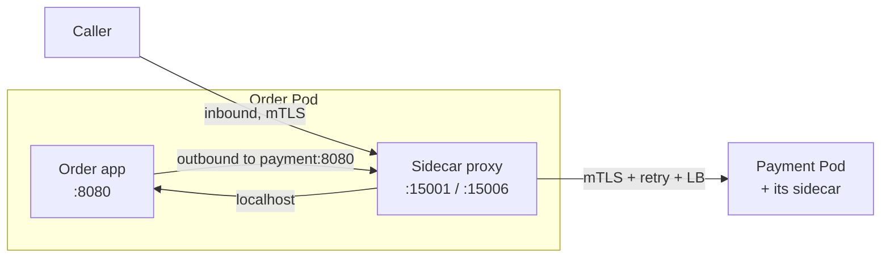
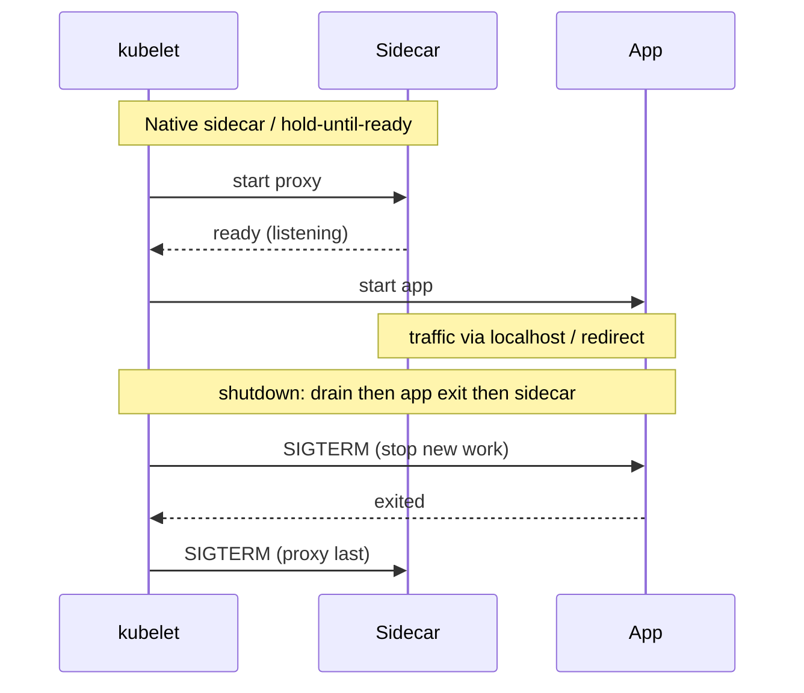
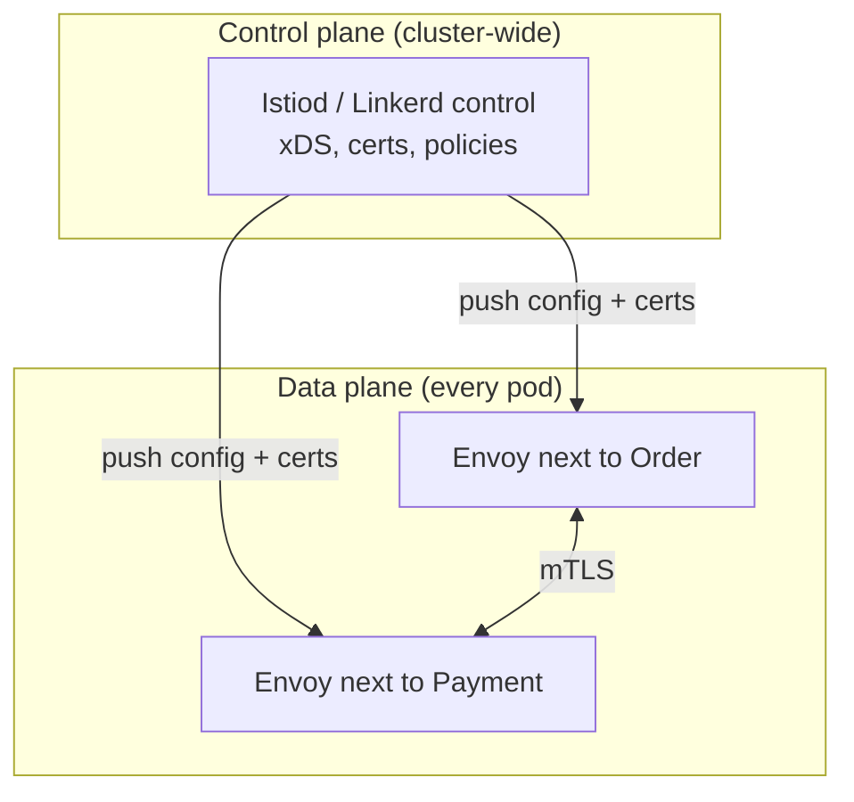

# Sidecar Pattern in Microservices — Detailed Study

Starting reference: [Sidecar Pattern walkthrough](https://youtu.be/sh2nwXJLDkE?si=fDAiy7YgHhFvSvAK)

This note is a mid-to-senior study of the **Sidecar Pattern**: a helper process deployed **alongside** each service instance (same pod / host / network namespace) that takes **cross-cutting** work off the main application so the app stays a business-logic binary. It is the deployment shape behind service meshes, log shippers, and most “the platform handles mTLS” answers.

Related local notes: `Circuit_Breaker_Pattern.md` (retries / timeouts / outlier detection often live *in* the sidecar), `Service_Discovery_Pattern.md` (mesh sidecar as the smart datapath), `Aggregator_Pattern.md` (composition is a *service* job; the sidecar is not an aggregator), `API_Gateway_Pattern.md` (edge proxy vs per-pod proxy).

---

## 1. What it is

A **sidecar** is a second process (almost always a second container) that is **colocated** with the application instance and shares its fate:

- Same machine / VM / **Kubernetes Pod**
- Same **network namespace** (they can talk on `localhost`)
- Often a **shared volume** (logs, sockets, config, secrets)
- Same **lifecycle** as the instance: scheduled together, restarted together, torn down together (with ordering caveats — §5)

The application keeps domain code: orders, payments, pricing. The sidecar owns **platform** concerns the team does not want to rewrite in every language: proxying, mTLS, retries, telemetry, config, secrets, protocol translation.

```
┌─────────────────────────────────────────┐
│  Pod / host  (one replica of Order)     │
│                                         │
│   ┌──────────────┐   localhost / UDS    │
│   │  Order app   │◄──────────────────►  │
│   │  (business)  │   ┌──────────────┐   │
│   └──────────────┘   │   Sidecar    │   │
│                      │  (platform)  │   │
│                      └──────────────┘   │
└─────────────────────────────────────────┘
           │
           ▼  cluster / internet
```

Interview-safe sentence: *A sidecar is a colocated helper with the same lifecycle as the app instance. It handles cross-cutting concerns so every microservice does not embed the same proxy, TLS, and telemetry library.*

**What it is not:**

- Not a **second microservice**. It does not own a bounded context or a public API of its own. It is infrastructure attached to *this* replica.
- Not a **shared DaemonSet** that serves the whole node (that is a node agent — §8).
- Not an **API gateway**. A gateway is a shared edge hop for many services. A sidecar is **1:1 with a replica**.
- Not an **aggregator / BFF**. Composition of Catalog + Pricing is a product service. The sidecar does not merge business DTOs.

---

## 2. Origin / analogy

The name is the **motorcycle sidecar**: bolted to the bike, goes where the bike goes, is not the engine.

| Motorcycle | Software |
| --- | --- |
| Bike = the thing that does the job | Application container = business logic |
| Sidecar = extra seat / luggage, same trip | Helper process = proxy, logs, certs |
| Unhitch it and the bike still runs (worse) | Kill Envoy and the app may still bind a port — but it loses mesh policy |
| You do not put a second engine in the sidecar | Do not put checkout / domain writes in the sidecar |

Microsoft and Chris Richardson both use this colocated-helper definition. Richardson’s catalogue also splits two **specializations** that are still deployed as sidecars: **Ambassador** (network proxy) and **Adapter** (interface translation) — §7. Interviews that treat those three as unrelated patterns miss the point: ambassador and adapter *are* sidecars with a narrower job.

---

## 3. Why it exists: stop putting the platform in the JAR

Without a sidecar, every service implements (or vendors) the same stuff **in-process**:

| Concern | In-process library | Sidecar |
| --- | --- | --- |
| Language | One library per language (Java agent, `requests` wrappers, Go middleware) | One Envoy / Fluent Bit binary next to Python, Java, Go, Node |
| Upgrade | Rebuild + redeploy **every** service to bump the retry library | Roll the sidecar image (or mesh) independently of app code — in theory |
| Blast of a bug | Only that language’s services | Every pod that runs that sidecar version |
| Isolation | A hung telemetry agent can stall the JVM | Separate process; crash of the helper is not a crash of the app (until traffic depends on it) |
| Heterogeneous stacks | “We only support Java” | Polyglot by default |

This is why Netflix, Google (Istio), and Buoyant (Linkerd) pushed **out-of-process** proxies: you cannot standardize mTLS and retries across 12 languages with 12 copies of Hystrix.

The other extreme is a **node-level** agent (DaemonSet). Cheaper (one per node, not one per pod) but weaker isolation: one agent serves many apps, network is not `localhost` to a single replica, and a noisy neighbor can starve everyone on the node. Sidecar is the middle: **isolation of a library, language-agnostic like a DaemonSet**.

---

## 4. Typical jobs (what actually runs in the sidecar)

Anything **cross-cutting** that should not be in the business binary:

| Job | What the sidecar does | Common binaries |
| --- | --- | --- |
| **Service proxy / mesh data plane** | Inbound + outbound L7: discover, LB, retries, timeouts, outlier, traffic split | Envoy (Istio, Consul), Linkerd2-proxy |
| **mTLS** | Terminate / originate TLS; rotate certs from the control plane | Same proxies; SPIRE agent sometimes |
| **Telemetry** | Access logs, metrics (RED), trace spans (zipkin/otlp) without app changes | Envoy, OpenTelemetry Collector |
| **Log shipping** | Tail app stdout or a volume, parse, ship to Loki/ELK | Fluent Bit, Vector, Filebeat |
| **Config / secrets sync** | Watch a store, write files / env the app already knows how to read | Vault agent, AWS App Mesh / Consul template, config reloader |
| **Adapter / protocol** | Speak Redis protocol, or expose `/metrics` in Prometheus format, or wrap a legacy TCP app | Custom container, Envoy ext_authz / filters |
| **Security policy** | Authn/z at the proxy (JWT, OPA, external auth) before the request hits the app | Envoy + OPA, Istio AuthorizationPolicy |

The **industrial** sidecar in 2026 is the **service-mesh data plane**. Log shippers and Vault agents are still sidecars; they just are not “the mesh.”



The app still thinks it called `http://payment:8080`. Iptables / eBPF / `HTTP_PROXY` **transparently** divert that through the local sidecar. That transparency is the product; it is also why “the sidecar ate my request” is a real on-call class.

---

## 5. Kubernetes: extra container, same Pod

In Kubernetes the sidecar is **not magic**. It is another container in the Pod spec:

```yaml
spec:
  containers:
    - name: order-app
      image: order:1.4.2
      ports: [{ containerPort: 8080 }]
      volumeMounts: [{ name: logs, mountPath: /var/log/app }]
    - name: envoy   # or fluent-bit, vault-agent, ...
      image: envoy:1.31
      volumeMounts: [{ name: logs, mountPath: /var/log/app, readOnly: true }]
  volumes:
    - name: logs
      emptyDir: {}
```

**What is shared (same Pod):**

| Resource | Shared? | Why it matters |
| --- | --- | --- |
| **Network namespace** | Yes | App ↔ sidecar = `127.0.0.1`. One Pod IP. kube-proxy / Service target that IP. |
| **IPC / UDS** | Yes if you mount it | Envoy can talk over a Unix socket; lower overhead than TCP localhost |
| **Volumes** | If you declare them | Log tailing, injected certs, bootstrap config |
| **cgroup / CPU+RAM** | **No** — per container (then summed on the Pod) | You must **request/limit both**. A 50Mi Envoy × 4,000 pods is not free. |
| **Kernel / node** | Yes | Noisy neighbor at node level still exists |

**Lifecycle caveats (this is where junior answers die):**

1. **Start order.** Classic Pod: kubelet starts containers **in parallel**. Envoy may not be listening when the app starts calling `localhost`. Mesh injectors use **iptables redirect** plus a **hold-application-until-proxy-ready** (Istio `holdApplicationUntilProxyStarts`, or native sidecar containers).
2. **Stop order.** On SIGTERM, if the **proxy dies first**, in-flight app traffic blackholes. You want: stop taking new work → drain proxy → then kill app — or native sidecars that **stay up until regular containers exit**.
3. **Readiness.** A Pod is Ready only if **all** containers (that have readiness probes) pass. A crash-looping Fluent Bit can take the **app** out of the Service. Decide: is the helper required for serving? If logs are best-effort, do not gate Ready on the shipper. If mTLS proxy is required, **do** gate Ready on Envoy.
4. **Native sidecar containers (K8s 1.28+, GA later).** Init containers with `restartPolicy: Always` start **before** app containers, restart independently, and terminate **after**. That is the platform fix for the start/stop races above. Interviewers in 2026 expect this phrase.
5. **Injection.** Istio/Linkerd **mutate** the Pod at admission (add container + volumes + iptables init). The app YAML never mentions Envoy. That is convenient and a debugging tax: the running spec ≠ git spec.



---

## 6. Service mesh: the industrial sidecar

A **service mesh** is sidecar-as-a-product plus a **control plane**.

| Plane | What it is | Examples |
| --- | --- | --- |
| **Data plane** | The per-pod proxy that actually handles packets | Envoy (Istio, Consul Connect), Linkerd2-proxy (Rust) |
| **Control plane** | Watches k8s, issues certs, pushes routes / retries / authz to proxies | Istiod, Linkerd destination + identity, Consul |



**What the mesh sidecar does** (see also `Service_Discovery_Pattern.md` § mesh, `Circuit_Breaker_Pattern.md` §8):

- Discovers endpoints via **xDS** (control plane reads EndpointSlices)
- Load-balances, retries, timeouts, **outlier detection** (eject a sick *pod*)
- **mTLS** between pods without the app knowing
- Telemetry on every hop

**What it does not do:**

- Business **fallback** (“approve orders under $X if Fraud is down”) — that stays in the app
- Aggregating Catalog + Pricing — that is `Aggregator_Pattern.md`
- Replacing Kubernetes Services / CoreDNS as the source of membership — the mesh **consumes** them

**Sidecar-less meshes (why interviews mention Ambient / Cilium):** at huge replica counts, one Envoy per pod is the cost that exceeds the benefit (§9–10). Istio **Ambient** (ztunnel per node + optional waypoint), Cilium **eBPF**, and similar designs keep mesh features **without** a full sidecar in every pod. The *pattern* is still “out-of-process platform datapath”; the *deployment* is no longer a sidecar. Know the distinction.

Linkerd’s pitch vs Istio: **smaller, faster Rust proxy**, simpler ops; Istio: Envoy’s filter ecosystem, richer L7 policy, heavier. Both are sidecars (or were, until ambient).

---

## 7. Ambassador vs sidecar vs adapter (Chris Richardson)

Three names, **one deployment trick** (colocated helper), **three intents**.

| Pattern | Job | Typical traffic | Example |
| --- | --- | --- | --- |
| **Sidecar** (generic) | Any colocated helper: logs, secrets, proxy, metrics | Local files, localhost, or intercepted I/O | Fluent Bit tailing `/var/log`; Vault agent writing a token file |
| **Ambassador** | **Proxy** between the app and the **network** (usually outbound, often inbound too) | App → ambassador → world | Envoy outbound to a SaaS; a local Redis proxy; mesh sidecar as ambassador |
| **Adapter** | **Translate** the app’s interface into what the platform / peers expect | App’s weird output → standard input | Sidecar that scrapes a proprietary `/stats` and exposes Prometheus `/metrics`; wrap a mainframe TCP protocol as gRPC |

```
Ambassador:     App ──► [proxy sidecar] ──► other services / internet
Adapter:        App ──► [translator sidecar] ──► standardized API / bus
Generic sidecar: App and helper share a volume or localhost; helper may never proxy traffic
```

**Accurate but brief:**

- Every ambassador and every adapter **is** a sidecar (colocated, same lifecycle).
- Not every sidecar is an ambassador: a log shipper never speaks on the request path.
- Mesh Envoy is **both** ambassador (all network I/O) and a bit of adapter (uniform mTLS, headers, telemetry).
- Do not confuse **adapter sidecar** with **anti-corruption layer** in a strangler (`Strangler_pattern.md`): ACL is a *domain* translation service (or module). Adapter sidecar is usually *operational* (metrics, protocol). They can coincide if you wrap a legacy binary.

Microsoft’s **Ambassador pattern** write-up is the outbound-proxy special case. If the interviewer says “sidecar vs ambassador,” answer: *ambassador is a sidecar whose job is to proxy; sidecar is the general colocated-helper pattern.*

---

## 8. Contrast: library vs sidecar vs DaemonSet vs gateway

| Approach | Where it runs | Polyglot | Upgrade | Extra hop | Isolation | Use when |
| --- | --- | --- | --- | --- | --- | --- |
| **Library / SDK** | In-process | No | App release | None | None (shared heap/threads) | One language, tiny estate, feature is a few lines (timeout on one client) |
| **Sidecar** | Sibling container in the **Pod** | Yes | Sidecar image / mesh | Localhost (~sub-ms) | Process isolation | Mesh, mTLS, uniform telemetry, mixed languages |
| **DaemonSet / node agent** | One per **node** | Yes | Node rollout | Pod → node IP | Shared across all pods on the node | Log/metrics agent where per-pod cost is silly; CNI; kube-proxy |
| **API gateway** | Shared cluster hop | Yes | Gateway deploy | Extra network hop for **all** clients | Shared by many services | Edge: auth, rate limit, routing — not per-replica mTLS |
| **Init container** | Runs **to completion** then exits | Yes | Image | N/A | Temporary | Migrations, wait-for, iptables setup — **not** a sidecar (unless native sidecar flavor) |

**Library vs sidecar (the question they actually want):**

- Library: zero extra RAM, zero extra hop, full access to domain types for fallback. Cost: every language, every upgrade is an app deploy, a bad library can GC-pause the business JVM.
- Sidecar: one implementation, independent binary, crash isolation. Cost: CPU/RAM **per replica**, localhost latency, two things to debug, version skew between app and proxy.

**DaemonSet vs sidecar:** Fluent Bit as DaemonSet reads all containers’ logs via the node. Cheaper. A compromised or OOM agent affects **every** pod on the node. Sidecar log shipper isolates noisy apps and can use a shared volume with *that* app only. Large clusters often use **node agents for logs** and **sidecars for the mesh**.

---

## 9. Trade-offs (say these out loud)

**Cost per pod.** Envoy is often 50–150 MiB + some CPU at idle, more under L7 policy. Multiply by replica count. This is the #1 reason for ambient / eBPF meshes and for “do not sidecar a 20 MiB Go health-check service.”

**Latency.** Inbound + outbound each add a local proxy hop. Usually sub-millisecond on localhost; still shows up in p99 when you wrap *every* call, especially with Lua/Wasm filters, huge access logs, or mis-tuned retries.

**Operational complexity.** Two containers to probe, two images to CVE-scan, iptables/eBPF redirects, “works in curl inside the app container, fails through the mesh.” On-call must read **proxy access logs**, not only app logs.

**Version skew.** App `v1.4` + Envoy `v1.28` vs app `v1.5` + Envoy `v1.31`. A mesh upgrade can change retry semantics under a service that did not change a line of Java. Pin and canary **sidecar** rollouts like you canary apps.

**Blast radius of a bad sidecar rollout.** A library bug ships with one team’s release. A bad Istio/Envoy config or image can stall **every** injected namespace. Control plane outage: new pods may not get config; existing proxies often keep last-known (like discovery caches — `Service_Discovery_Pattern.md`). Still: treat mesh upgrades as **cluster events**, not library bumps.

**Readiness coupling.** Helper crash → Pod not Ready → replica removed from Service. That is correct for a required proxy and a footgun for an optional log sidecar.

**Security.** Extra attack surface (proxy admin port, debug endpoints). Also a **win**: mTLS and authz enforced even if the app is a naive HTTP server.

**Transparency tax.** Invisible redirect means the app cannot easily “not use the mesh” for a specific call (egress to a weird protocol) without `ServiceEntry` / annotations. Document exceptions.

---

## 10. When to use it / when not

**Use when:**

- You have **multiple languages** and need one policy for retries, TLS, and telemetry.
- You are adopting a **service mesh** (Istio, Linkerd, Consul) — the sidecar *is* the data plane.
- You must attach behavior to a **binary you cannot change** (vendor app, legacy, CGI).
- Secrets/config should be **injected as files** by Vault agent / CSI rather than baked into the image.
- You want process isolation for a crashy helper (log parser) without taking the JVM with it.

**Do not use when:**

- A **library is enough**: one language, one HTTP client, timeouts/retries already in Resilience4j/Polly, no mesh requirement. Extra container is ceremony.
- The **platform already provides it**: Kubernetes Service + NetworkPolicy + an ingress controller may be enough; node-level eBPF may already do encryption. Do not stack Envoy on Cilium on nginx for the same hop.
- **Sidecar cost exceeds benefit at huge scale**: 10k pods × 100 MiB = a terabyte of proxy. Then ambient mesh, node proxies, or “TLS in the app for the three services that need it.”
- The helper is **cluster-wide not per-replica**: cluster DNS, ingress, and often log collection belong on a DaemonSet or a managed pipeline.
- You were about to put **business aggregation or saga orchestration** in Envoy filters. That is the wrong layer.

---

## 11. Mental model for interviews (one paragraph)

*A sidecar is a helper process glued to each service replica — same pod, localhost, shared volumes, shared fate — so the app stays business logic and the helper does platform work: proxy, mTLS, retries, metrics, logs, secrets. It is the motorcycle sidecar, not a second service. Kubernetes implements it as another container; native sidecars fix start/stop order. A service mesh is this pattern industrialized: Envoy/Linkerd data plane plus a control plane that pushes config. Ambassador is the proxy specialization; adapter is the interface-translation specialization; a log shipper is a sidecar that is neither. Compared with a library it is polyglot and independently versioned, at the cost of RAM, a local hop, and cluster-wide blast radius if you roll a bad proxy. Skip it when a library or the platform already does the job, or when per-pod proxies dominate the bill.*

---

## 12. Interview questions (5–6 year bar)

### Q1: What is the sidecar pattern?

**Answer:** A colocated helper process (usually a second container in the same Pod) that shares the app’s network and lifecycle and takes cross-cutting concerns — proxying, TLS, telemetry, config — so the application binary stays focused on domain logic.

### Q2: Why not a library?

**Answer:** Libraries are language-specific, upgrade with every app, and share fate with the JVM/runtime. Sidecars are polyglot, one implementation, process-isolated. Cost: memory, localhost latency, ops. For a single-language estate with no mesh, a library is often the right call.

### Q3: How does Kubernetes run a sidecar?

**Answer:** Extra container in the Pod. Shared network namespace (`localhost`), optional shared volumes, separate CPU/memory. The Pod IP is the unit of Service routing. Readiness is AND of containers unless you omit a probe on the helper.

### Q4: Start/stop order problems?

**Answer:** Default: containers start together; app can send traffic before Envoy listens. On shutdown the proxy can die first and blackhole in-flight requests. Fix: native sidecar containers (start first, stop last), Istio hold-application-until-proxy-starts, and drain on SIGTERM. Do not ignore this in a mesh design review.

### Q5: Sidecar vs DaemonSet?

**Answer:** Sidecar is **per pod** (isolation, 1:1 resources). DaemonSet is **per node** (cheaper, shared fate for everything on the node). Mesh and per-app secrets → sidecar. Node logs / CNI / kube-proxy → DaemonSet.

### Q6: Ambassador vs sidecar vs adapter?

**Answer:** Sidecar = colocated helper (general). Ambassador = sidecar that **proxies** app ↔ network. Adapter = sidecar that **translates** interfaces (proprietary metrics → Prometheus). Mesh Envoy is an ambassador (and more). Fluent Bit is a sidecar, not an ambassador.

### Q7: Control plane vs data plane in a mesh?

**Answer:** Data plane: the sidecar proxy on the request path. Control plane: istiod/Linkerd, not on the request path, pushes xDS, certs, policy. App talks to localhost; sidecar talks to other sidecars with mTLS. Control plane outage should not drop *existing* config; it blocks *new* programming.

### Q8: Does the mesh sidecar replace application circuit breakers?

**Answer:** No. Mesh outlier detection ejects a **bad pod** and enforces timeouts/retries. Business fallback (“skip Fraud under $X”) lives in the app (`Circuit_Breaker_Pattern.md`). They stack.

### Q9: What is the blast radius of a sidecar rollout?

**Answer:** A bad Envoy/Istio version or VirtualService can affect **every injected pod**, not one team. Canary the mesh, pin versions, have last-known-config behavior, and treat mesh upgrades as production events. Contrast: a bad Resilience4j bump only ships with services that bumped the JAR.

### Q10: When would you refuse a sidecar?

**Answer:** Tiny service, one language, library already does retries; platform already encrypts; replica count makes proxy RAM the dominant cost; the “sidecar” was going to implement checkout. Prefer node agent or ambient mesh if the feature is cluster-wide.

### Q11: Can the app talk to the sidecar? How?

**Answer:** `127.0.0.1`, UDS, or **transparent** redirect (iptables/eBPF) so the app still dials `payment:8080`. Admin API on a localhost port for drain/stats. Never expose Envoy admin on the Pod IP.

### Q12: Shared volume vs localhost — when each?

**Answer:** Volume: logs, cert files, rendered config (Vault, log shipper). Localhost/UDS: request proxying, health, metrics scrape. Mixing: app writes logs to volume; Fluent Bit tails; Envoy still on the HTTP path.

### Q13: Istio vs Linkerd in one sentence?

**Answer:** Both: sidecar data plane + control plane. Istio: Envoy, heavy feature set, richer L7. Linkerd: Rust micro-proxy, operational simplicity, smaller footprint. Ambient Istio is the sidecar-less evolution of the same idea.

### Q14: Is an API gateway a sidecar?

**Answer:** No. Gateway is a **shared** front door (many services, one hop). Sidecar is **per replica**. A gateway may *also* be Envoy; that does not make it a sidecar. Edge policy vs east-west policy.

### Q15: How do you test / debug “the sidecar ate my request”?

**Answer:** Exec into the **app** container and curl localhost vs curl the Service; compare with `curl` through the proxy port. Read Envoy access logs and `istioctl proxy-config` / Linkerd tap. Check mTLS identity, retries amplifying 5xx, and whether readiness included the sidecar. Tracing should show two spans (app + proxy) per hop.

### Q16: Native Kubernetes sidecar containers vs “just two containers”?

**Answer:** Two containers is the old pattern: parallel start, equal stop, Ready AND. Native sidecars (init + `restartPolicy: Always`) give guaranteed **startup before** the app and **shutdown after**, plus independent restart of the helper. Use them for proxies; optional shippers may still be regular containers without a readiness probe.

---

## 13. Further reading

- Chris Richardson — [Pattern: Sidecar](https://microservices.io/patterns/deployment/sidecar.html) (colocated helper for cross-cutting concerns); [Service mesh](https://microservices.io/patterns/service-mesh.html) (industrial sidecar data plane)
- Microsoft Learn — [Sidecar pattern](https://learn.microsoft.com/en-us/azure/architecture/patterns/sidecar), [Ambassador pattern](https://learn.microsoft.com/en-us/azure/architecture/patterns/ambassador) (proxy specialization of sidecar)
- Istio — [Architecture](https://istio.io/latest/docs/ops/deployment/architecture/) (control vs data plane), [Ambient mesh](https://istio.io/latest/docs/ambient/) (sidecar-less)
- Linkerd — [What is a service mesh?](https://linkerd.io/what-is-a-service-mesh/)
- Kubernetes — [Sidecar containers](https://kubernetes.io/docs/concepts/workloads/pods/sidecar-containers/) (native sidecars)
- Envoy — [Architecture overview](https://www.envoyproxy.io/docs/envoy/latest/intro/life_of_a_request)
- Related: `Service_Discovery_Pattern.md` (mesh as server-side discovery), `Circuit_Breaker_Pattern.md` §8 (mesh outlier vs app breaker)
