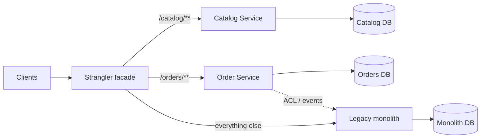
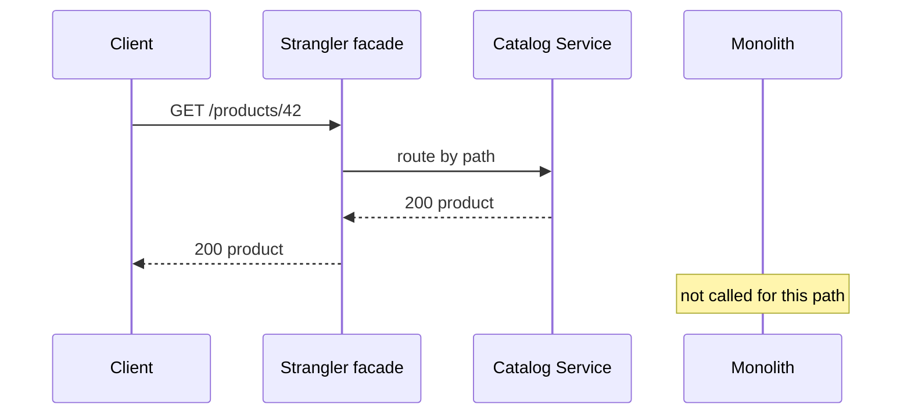
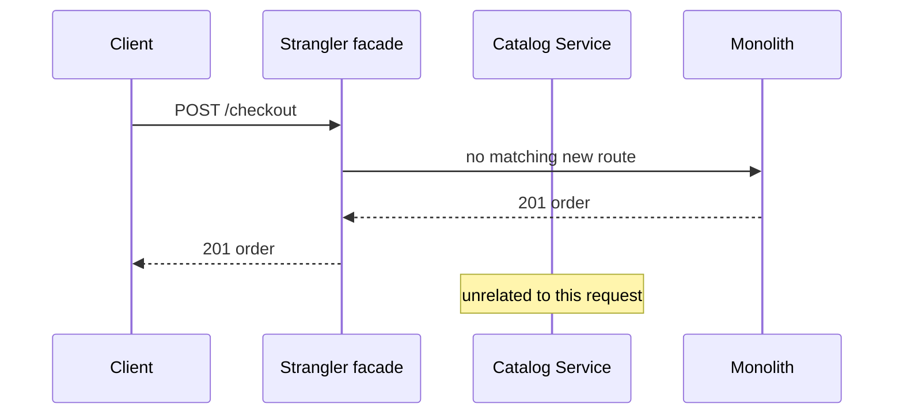

# Strangler Fig Pattern in Microservices — Detailed Study

Starting reference: [Strangler Pattern walkthrough](https://youtu.be/DpuQ3-7e-rY?si=X2ocVAOx7rdwmtFx)

This note is a mid-to-senior study of the **Strangler Fig Pattern** (often shortened to **Strangler Pattern**): how you incrementally replace a legacy system by wrapping it, growing new services around it, and retiring the old system only after traffic has moved. In microservices this is the default *safe* path from a monolith — not a rewrite weekend.

Related local notes: `FINAL/MICROSERVICES/DISTRIBUTED_system.md` (why a extracted service is now a distributed system), `FINAL/MICROSERVICES/Saga_Pattern.md` (cross-service writes after you split a transaction), `FINAL/MICROSERVICES/Event-Driven_Architecture.md` (sync facade vs async cutover).

---

## 1. Origin and the metaphor

Martin Fowler named it after **strangler fig** trees (Queensland / rainforest): a fig germinates in the canopy of a host tree, sends roots down, wraps the trunk, and eventually stands on its own. The host dies; the fig remains. The replacement is **gradual**. There is no day when you fell the old tree and hope a new one is already 40 metres tall.

In software (Fowler, 2004): you do not freeze the business for a multi-year rewrite. You put a **facade** in front of the legacy system, intercept calls, and **grow** a new implementation around the old one. New behaviour lives in the new system. Old behaviour stays in the legacy system until a slice is ready. When nothing useful remains behind the facade, you **decommission** the host.

Microsoft and most cloud architecture catalogues use the same idea for **monolith → microservices**: the facade is typically an API gateway or reverse proxy; the “new growth” is a set of services; the host is the monolith.

The pattern is **not** “extract every class into a service.” It is **replace capability by capability**, with the live system still shipping features.

---

## 2. Why it matters in microservices

A monolith that still earns money has three ugly options:

| Approach | What you do | Typical failure mode |
| --- | --- | --- |
| **Big-bang rewrite** | Build System B in parallel; cut over on a weekend | Scope explodes; requirements drift; cutover is irreversible; you discover the real edge cases in production |
| **Keep patching the monolith** | New features land in the same codebase | Delivery slows; deploys get riskier; you never get independent scale or team ownership |
| **Strangler** | Facade + extract bounded contexts one at a time | Dual-running cost; incomplete strangling if you stop halfway |

Microservices interviews expect you to say: **strangler is how you migrate without a big-bang rewrite.** You get independent deploy of *extracted* slices while the rest of the business keeps using the monolith. Each extraction is a **reversible** routing change, not a company-wide flip.

It also forces the design work you actually need: **bounded contexts**, ownership of data, and a seam at the HTTP/event boundary — the same seams you would have designed if you had started with services.

---

## 3. How it works

Put a **strangler facade** in front of everything clients already call. Clients must not keep talking to the monolith directly, or you cannot intercept traffic.

```
  Clients (web, mobile, partners)
                 |
                 v
        +------------------+
        | Strangler facade |   API gateway / reverse proxy / BFF
        |  routing rules   |
        +--------+---------+
                 |
      +----------+-----------+
      |                      |
      v                      v
+-----------+         +------------------+
| New MS    |         | Legacy monolith  |
| Catalog,  |         | everything else  |
| Checkout… |         |                  |
+-----------+         +------------------+
```

Rules of the game:

1. **New features** go to new services (or to a new module that is *already* a service), not into the monolith — otherwise the host keeps growing and you never strangle it.
2. **Existing behaviour** stays in the monolith until that slice is extracted, verified, and routed.
3. The facade **routes** by URL, header, tenant, percentage, or feature flag: `/catalog/**` → Catalog Service; everything else → monolith.
4. When a path is 100% on the new service and stable, **delete** the equivalent code (and later the tables) from the monolith. That is the “strangle” step. Routing without deletion is just a proxy.

The facade is a **traffic and composition** layer. It is not the place to re-implement domain logic. If the gateway becomes a second monolith, you have failed the pattern.

---

## 4. Typical flow (one bounded context at a time)

Do not start with “extract User, because everyone needs User.” Start with a **seamed** capability: clear API, few inbound/outbound couplings, a team that can own it.

```
identify bounded context
        |
        v
carve a seam (API + data ownership)
        |
        v
build new service (+ anti-corruption layer if models differ)
        |
        v
route a slice of traffic (canary / tenant / % )
        |
        v
verify (correctness, latency, shadow compare)
        |
        v
shift 100% → remove dead path from monolith
        |
        v
repeat until the host is empty → decommission
```

Worked example: an e-commerce monolith.

| Step | Extract | Facade rule | Done when |
| --- | --- | --- | --- |
| 1 | Product catalog (read-heavy, stable) | `GET /products/**` → Catalog Service | Search and PDP no longer hit monolith |
| 2 | Inventory reservations | `/inventory/**` → Inventory Service | Stock counts owned by Inventory DB |
| 3 | Checkout / payments | `/checkout/**` → Order + Payment | Place-order transaction is no longer one monolith TX (now a saga) |
| 4 | Remaining admin / reports | last slices or a thin leftover | Monolith process stopped; DB archived |

Each step is a **product increment**. You can pause after Catalog and still have a working system. You cannot pause a 70% big-bang rewrite and ship.

---

## 5. Key components

| Component | Job | Typical tech |
| --- | --- | --- |
| **Strangler facade** | Single entry; routing; sometimes auth, rate limit, aggregation | API Gateway (Spring Cloud Gateway, Kong, AWS API GW), reverse proxy (NGINX, Envoy), BFF |
| **Legacy monolith** | Remaining behaviour; source of truth until a slice moves | Existing app + DB |
| **New microservices** | Extracted capabilities, own deploy and (ideally) own data | Independent services |
| **Routing rules** | Which requests go where; canaries and kill switches | Path, host, header, weighted routes, feature flags |
| **Anti-corruption layer (ACL)** | Translates legacy models/IDs/events into the new domain so the new service is not poisoned by the old schema | Adapter module in the new service, or a dedicated translator |
| **Dual-write / dual-read** (optional, dangerous) | During cutover, write both stores or compare both reads | Outbox, change-data-capture, shadow traffic |

**Facade vs ACL:** the facade **routes**. The ACL **translates**. Mixing them into one “smart gateway” that maps every legacy field is how the facade becomes the bottleneck.

**Data:** the hard part is not HTTP routing. It is **who owns the table**. Options, in increasing hygiene:

1. New service still reads/writes the **monolith DB** (shared database). Fastest extraction, worst coupling. You have not really left the monolith.
2. **Replicate** (CDC from monolith → new DB; new service reads its copy). Good for read-side extracts.
3. **Dual-write** (app writes both) with idempotency and a reconciliation job. Easy to get wrong (dual-write problem).
4. **Cut over writes** to the new service; monolith calls the new service for that data. Then drop the old tables.

If you skip data ownership, you get “distributed monolith”: many processes, one schema, one deploy risk.

---

## 6. Architecture (happy path)



Sequence for a request that has already been extracted:



Sequence for a path still on the host:



Shadow / parallel compare (optional before 100% cutover):

```
Client → Facade → New service     (live response)
                ↘ Monolith       (async compare, ignore for user)
```

Use shadow traffic to catch semantic drift. Do **not** dual-charge a payment in shadow mode.

---

## 7. Comparison: rewrite, branch-by-abstraction, parallel run

These are related; interviews mix the names. Keep them distinct.

| Pattern | Layer | What moves | Reversibility | Typical use |
| --- | --- | --- | --- | --- |
| **Strangler fig** | Edge / system | Whole capabilities, behind a facade, over months/years | Change a route back to the monolith | Monolith → services; replace a packaged legacy app |
| **Big-bang rewrite** | Whole system | Everything, then one cutover | Poor — you already stopped investing in System A | Tiny system, or host is truly un-runnable |
| **Branch by abstraction** | **Code inside** one process | Swap implementations behind an interface; often still one deployable | Feature-flag the new impl | Refactor a module *before* or *instead of* a network extract; strangler *inside* the monolith |
| **Parallel run** | Behaviour | Both implementations execute; results compared | You have not committed to one yet | High-risk logic (pricing, tax, scoring) before you trust the new service |

**Strangler vs branch-by-abstraction:** Fowler / Hammant: branch-by-abstraction is how you replace a *library or module* without a long-lived git branch. You introduce an interface, put the new impl behind it, flip, delete the old impl. Strangler is the **same idea at system boundaries** (HTTP, messaging). You often **use both**: abstract inside the monolith to create a seam, then strangle that seam out to a service.

**Strangler vs parallel run:** parallel run is a **verification tactic** you can use *during* strangling (shadow reads, compare prices). It is not a migration strategy by itself. Running two checkouts forever is not a win.

**Strangler vs “just add an API gateway”:** a gateway in front of a monolith is **not** a strangler until you **move behaviour** and **delete** the old path. Otherwise you only added a hop.

---

## 8. Benefits

- **Lower risk than rewrite.** Each increment is small, production-tested, and can be routed back.
- **Continuous delivery.** The business keeps shipping on the monolith *and* on new services. No feature freeze.
- **Reversible.** Weighted routing and feature flags are kill switches. A bad Catalog extract does not require restoring a two-year rewrite.
- **Learning in production.** You learn real latency, data quality, and ownership issues on one context, not on the entire domain.
- **Team topology.** A team can own Catalog without touching checkout. That is the organisational reason to extract, not “Netflix envy.”
- **Incremental modernisation.** New stack, new DB, new observability — but only where the ROI is clear.

---

## 9. Risks and pitfalls

| Pitfall | What it looks like | What to do |
| --- | --- | --- |
| **Facade becomes a bottleneck / god gateway** | Aggregation, transformation, and workflow all live in NGINX/Spring Cloud Gateway | Keep the facade dumb: route, auth, limits. Domain composition in BFFs or services |
| **Dual maintenance** | Same feature in monolith *and* service for months | Time-box the overlap. Routing 100% then **delete**. Dual-run is a phase, not a lifestyle |
| **Data consistency at cutover** | Dual-write races; IDs diverge; stock reserved twice | Prefer CDC + one writer. Sagas after write ownership moves. Reconciliation jobs. Idempotency keys |
| **Forever strangler** | 40% extracted, 60% still the ball of mud, gateway forever | Treat decommission as a milestone. Track “% of traffic / tables still on host.” Stop extracting if you will not finish a slice |
| **Shared DB coupling** | “Microservice” that JOINs monolith tables | If you cannot move the data, you extracted a process, not a service. Plan the data move or do not pretend |
| **Chatty sync calls back to the monolith** | New service HTTP-calls the monolith for every request | That is still the monolith, with extra latency. ACL + events or replicate the data you need |
| **No seams** | Everything is one transaction, one table, one UI | Invest in branch-by-abstraction *inside* first, or you will extract a distributed mess |
| **Client bypass** | Mobile app still hits `monolith.internal` | Facade only works if it is the **only** front door. DNS, mesh, and auth must enforce it |
| **Distributed monolith** | 15 services, one release train, one DB | You paid microservice cost without the benefit. Strangle **contexts**, not classes |

The pattern **adds** operational load (two systems, routing, extra hops) until the host is gone. If you never kill the host, you paid the tax forever.

---

## 10. When to use it / when not to

**Use when:**

- A living monolith (or packaged legacy) still ships, and a rewrite would take longer than the business can freeze.
- You can identify **bounded contexts** with a network seam (HTTP, messages, files).
- You can put a facade as the **only** client entry (or migrate clients in a controlled way).
- Leadership will fund **finishing** slices (delete old code), not only launching new services.
- You need to modernise *parts* of the system (scale catalog independently, isolate payments) without boiling the ocean.

**Do not use when:**

- **Greenfield.** There is no host to strangle. Design services (or a modular monolith) from the start.
- The system is **small** and a rewrite is weeks, not years. Strangler overhead (dual run, facade, data sync) can exceed the rewrite.
- The host is **unmaintainable and un-seamed** (no tests, no module boundaries, one 400-column table) *and* you have a mandate to replace it — then a rewrite (or a replacement product) may be honest. Strangler still needs seams; you may have to create them first (branch-by-abstraction) rather than skip to 20 services.
- You cannot operate two platforms (security, compliance, on-call). Dual-running without ops capacity is an incident factory.
- The goal is only **resume-driven** “we use microservices.” Extracting random endpoints will make things worse.
- You need a **single atomic cutover** for legal/financial reasons (one ledger, one regulator window) and cannot split writes. Then parallel run + one flip, or stay on one system.

Strangler is a **migration** pattern. It is the wrong answer to “how should I design a new platform?”

---

## 11. Mental model for interviews (one paragraph)

*A strangler fig replaces a host tree slowly. In software, you put a facade in front of a legacy system, send new work to new services, and keep routing old work to the monolith until each bounded context is extracted, verified, and deleted from the host. That is how you go monolith to microservices without a big-bang rewrite. The facade routes; an anti-corruption layer translates; data ownership is the real cutover. Risks: god gateway, shared DB, forever dual-maintenance. Related but different: branch-by-abstraction (in-process swap) and parallel run (compare both implementations).*

---

## 12. Interview questions (5–6 year bar)

### Q1: What is the Strangler Fig Pattern?

**Answer:** Incremental replacement of a legacy system. A facade intercepts traffic; new functionality is implemented in a new system and routed there; remaining calls still hit the old system. Repeat by capability until the old system can be retired. Named by Martin Fowler after strangler fig trees.

### Q2: Why not a big-bang rewrite?

**Answer:** Rewrites freeze (or starve) the old system while requirements keep changing. Cutover is one high-risk moment with poor rollback. Strangler ships continuously, limits blast radius to one context, and can route back.

### Q3: Where does the facade live?

**Answer:** At the edge: API gateway, reverse proxy, or BFF — wherever clients already enter. It must be the **only** path you care about. The facade routes; it should not own domain workflows.

### Q4: What do you extract first?

**Answer:** A bounded context with a clear seam, high change or scale pressure, and tolerable data coupling — often a read-heavy capability (catalog, search) rather than the core ledger. Not “the User table because everything uses it.”

### Q5: Is an API gateway in front of a monolith already a strangler?

**Answer:** No. That is a reverse proxy. Strangling starts when **behaviour and (eventually) data** move, traffic is cut over, and the old path is **removed**.

### Q6: Strangler vs branch-by-abstraction?

**Answer:** Branch-by-abstraction: in-process interface, swap implementations, delete the old class/module. Strangler: the same idea across **process** boundaries via routing. Use abstraction to create a seam, then strangle the seam into a service.

### Q7: What is an anti-corruption layer here?

**Answer:** A translation layer so the new service’s model is not a copy of the monolith’s tables and IDs. Prevents the legacy schema from leaking into every new service. DDD term; in strangler it sits on the new side (or a dedicated adapter), not as 10,000 lines of gateway config.

### Q8: How do you handle the database?

**Answer:** Routing HTTP is easy; owning data is the migration. Avoid shared DB as the end state. Prefer: replicate for reads, one writer, CDC, then drop old tables. Dual-write only with idempotency and reconciliation. After checkout is extracted, cross-service consistency is a **saga**, not a local transaction.

### Q9: What is a “forever strangler”?

**Answer:** The team extracts a few services, leaves the ball of mud, and runs a gateway + monolith + half-services indefinitely. You pay dual-maintenance forever and never get a simpler estate. Success metric includes **decommission**, not just “we launched Catalog.”

### Q10: How do you know the new service is correct before 100% traffic?

**Answer:** Canaries by tenant or percent; shadow traffic (new service sees production reads, response not served); parallel run for critical calculations; contract tests; data reconciliation counts. Payments: never double-execute side effects in shadow.

### Q11: What if the new service must call the monolith?

**Answer:** Acceptable as a **temporary** ACL/RPC or event dependency. If every request still needs the monolith, you have not extracted a context — you have added latency. Plan to reverse the dependency (monolith calls the new service) or replicate the data.

### Q12: When would you refuse strangler and rewrite?

**Answer:** Small system; no identifiable seams and no time to create them; host cannot meet compliance and must die on a date; org cannot run two stacks. Even then, a replacement is often still rolled out **behind a facade** (strangler of a vendor/package) rather than a DNS flip with no rollback.

### Q13: How does this relate to the strangler *fig* specifically — why not “adapter”?

**Answer:** Adapter wraps an interface. Strangler **grows until the wrapped system is gone**. The end state is deletion of the host, not a permanent wrapper. If the wrapper is permanent, you built a facade or an ACL, not a completed strangler.

### Q14: What routing dimensions do you use besides URL path?

**Answer:** Headers (client version), tenant/id ranges (migrate customer 1–1000 first), weighted traffic, feature flags. Path is the default because it maps cleanly to bounded contexts. Identity-based routing helps when URLs are a mess.

### Q15: Name three metrics that show strangling is actually finishing.

**Answer:** (1) % of requests served by new services vs monolith, (2) tables/jobs still owned by the monolith DB, (3) deploy frequency / incident rate of the monolith (should fall as it shrinks). Bonus: time-to-rollback a bad extract (route flip).

### Q16: Can you strangle a batch/mainframe, not just an HTTP API?

**Answer:** Yes. Facade can be a file drop, a queue, a DB view, or a screen-scraping adapter. Same idea: intercept the integration point, replace slice by slice. HTTP gateways are just the common microservice case.

---

## 13. Further reading

- Martin Fowler — [Strangler Fig Application](https://martinfowler.com/bliki/StranglerFigApplication.html) (2004; the name and metaphor)
- Paul Hammant — [Branch by Abstraction](https://paulhammant.com/blog/branch_by_abstraction.html) (in-process cousin)
- Microsoft Learn — [Strangler Fig pattern](https://learn.microsoft.com/en-us/azure/architecture/patterns/strangler-fig)
- Microsoft Learn — [Anti-corruption layer](https://learn.microsoft.com/en-us/azure/architecture/patterns/anti-corruption-layer)
- Sam Newman — *Monolith to Microservices* (incremental split, data, and when *not* to split)
- Eric Evans — *Domain-Driven Design* (bounded contexts, ACL — the seams you extract)
